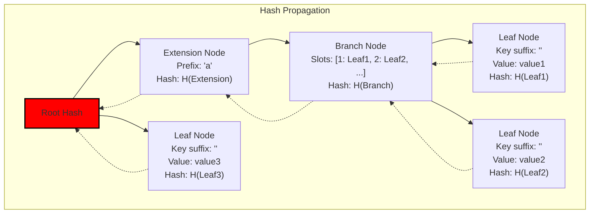
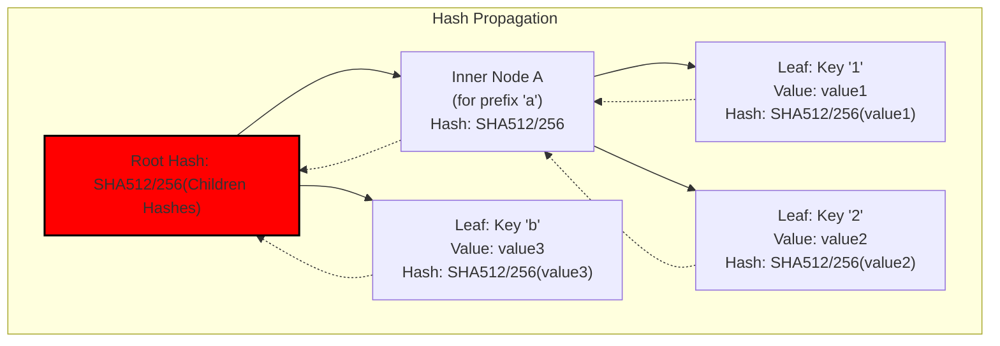
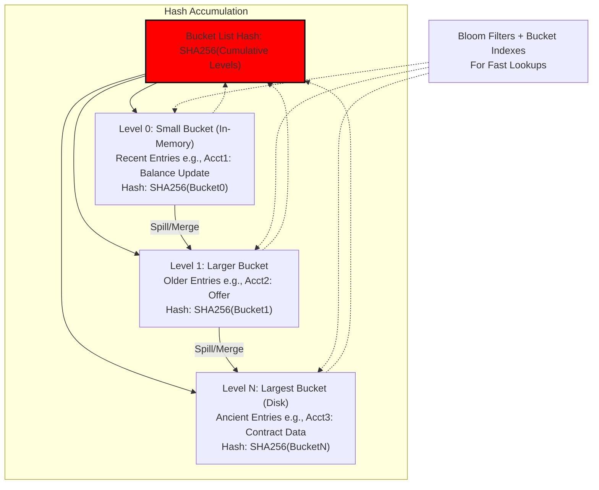
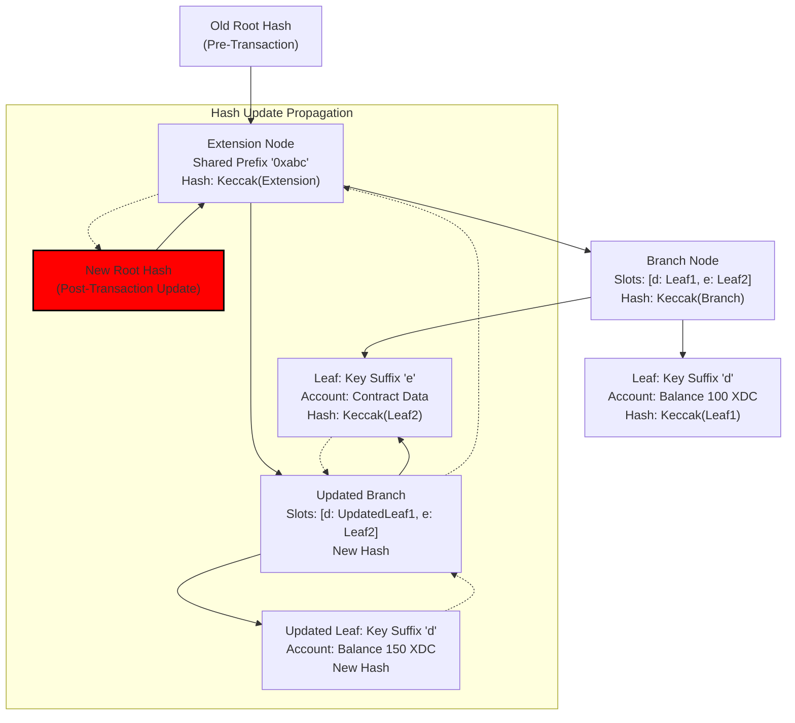
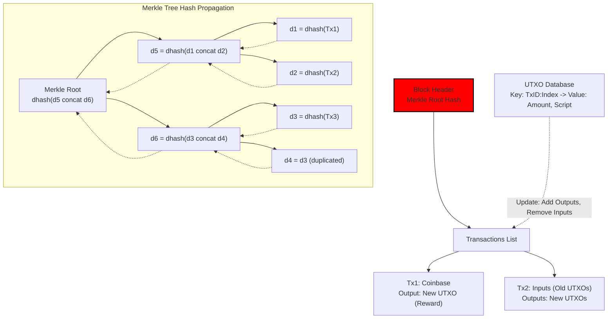

# Merkle Patricia Trie (MPT)

A Merkle Patricia Trie (MPT), also known as a Merkle Patricia Tree, is a specialized data structure that combines the efficiency of a Patricia Trie (a compact radix trie for storing and retrieving key-value pairs) with the cryptographic security of a Merkle Tree (a hash-based tree for data integrity verification). This hybrid design allows for efficient storage, updates, and proofs of large datasets, making it particularly suited for blockchain environments where data must be verifiable, tamper-resistant, and accessible with minimal overhead.

### Key Components

- **Trie Basics**: A trie (prefix tree) organizes data by breaking keys into paths from the root to leaves, where each edge represents a character or nibble (half-byte). This enables fast lookups by traversing the path corresponding to the key.
- **Patricia Optimization**: Short for "Practical Algorithm To Retrieve Information Coded in Alphanumeric," it compresses the trie by merging nodes with only one child, reducing space usage and path lengths for common prefixes.
- **Merkle Integration**: Every node in the trie includes a cryptographic hash of its contents and its children's hashes. This creates a "fingerprint" (root hash) for the entire structure, allowing efficient proofs that a specific key-value pair exists (or doesn't) without revealing the full dataset.

In Ethereum's implementation (the most prominent use case), the MPT is further modified:
- It's a **hexary trie** (each branch node has 16 children, corresponding to hexadecimal digits 0-9, a-f, plus a value slot), though still called "Patricia" for legacy reasons.
- Keys are typically 256-bit hashes (e.g., account addresses or storage slots), encoded as hex paths.
- Values can be account balances, nonce, code hashes, or contract storage.

Node Types in an MPT:
- **Null/Empty Node**: Represents an absent value or end of path.
- **Leaf Node**: Stores the remaining key suffix (if any) and the value. Structure: [encoded remaining key, value].
- **Extension Node**: Handles shared prefixes to compress the tree. Structure: [encoded shared prefix, child node hash].
- **Branch Node**: A decision point with up to 17 slots (16 for hex digits + 1 for a value if the key ends there). Structure: [child0, child1, ..., child15, value].

Each node's hash is computed using a cryptographic function (e.g., Keccak-256 in Ethereum), incorporating its type and contents. This ensures the tree is deterministic: identical key-value sets always produce the same root hash.

### How It Works
1. **Insertion/Update**: To add or modify a key-value pair, traverse the trie based on the key's hex representation. Split or create nodes as needed (e.g., insert an extension for shared prefixes or a branch for divergences). Update hashes bottom-up to recompute the new root hash.
2. **Lookup**: Follow the key's path from the root, decompressing extensions and branching as required, until reaching a leaf or value slot.
3. **Deletion**: Similar to update, but set the value to null and prune unnecessary nodes (e.g., merge extensions or remove empty branches).
4. **Proofs**: A Merkle proof provides a path of sibling hashes from the root to the target leaf. Anyone can verify the proof by recomputing hashes along the path, confirming data integrity without the full trie (useful for light clients).

This process ensures operations are O(log n) in time and space, where n is the number of entries, due to the trie's depth being proportional to key length.

Advantages:
- **Efficiency**: Compact storage and quick verifiable queries.
- **Security**: Immutable once hashed; tampering changes the root hash.
- **Scalability**: Supports state sharding and stateless clients in blockchains.

Disadvantages:
- **Complexity**: More intricate than simple key-value stores, with potential for high gas costs in updates (e.g., in Ethereum).
- **Overhead**: Hash computations add CPU load.

### Diagram: Simplified MPT Structure
Here's a visual representation of an MPT storing example key-value pairs (keys as hex strings for simplicity, e.g., "a1" -> value1, "a2" -> value2, "b" -> value3). The diagram shows node types and hash propagation.

### Use in Blockchains
MPTs are integral to account-based blockchains like Ethereum, where they store the "world state" (account balances, contract code, and storage), transaction receipts, and transactions within blocks. The block header includes root hashes for these tries, enabling quick validation of the entire state without downloading everything—crucial for consensus and light nodes.

 Variants appear in other chains:
- **Cardano**: Uses a modified MPT for eUTXO state management, enhancing privacy and scalability.
- **Nervos CKB**: Employs MPT for cell-based state, focusing on verifiable computations.
- **Others**: Polkadot and Hyperledger Fabric incorporate similar structures for secure data indexing.

In contrast, UTXO-based chains like Bitcoin use simpler Merkle Trees for transactions only, without the prefix compression of Patricia.

The MPT's design addresses blockchain challenges like state bloat and verification efficiency, evolving with upgrades (e.g., Ethereum's Verkle Trees as a potential successor for even better proofs).

---

## XRP

The XRP Ledger does not use a Merkle Patricia Trie (MPT) for its state management. Instead, it employs a data structure called **SHAMap** (SHA-Map), which is a hashed radix tree that incorporates Merkle-like properties for cryptographic verification and efficient storage. This structure is used to represent both the state data (account balances, settings, and other ledger objects) and transaction sets in a verifiable, tamper-resistant way.

### Key Components of SHAMap
- **Radix Tree Basis**: SHAMap is a radix-16 (hexary) tree, where each non-leaf node can have up to 16 children, corresponding to hexadecimal digits (0-9, a-f). Keys (e.g., 256-bit IDs for ledger entries) are broken into nibbles (4-bit chunks) to traverse the tree.
- **Merkle Integration**: Every node is hashed using SHA-512Half (the first 256 bits of SHA-512), incorporating the hashes of its children. This creates a root hash that serves as a cryptographic summary of the entire structure, similar to a Merkle Tree. It enables efficient proofs of inclusion/exclusion and delta computations between ledger versions.
- **Node Types**:
  - **Inner Nodes**: Branch points with child pointers and a hash based on their contents.
  - **Leaf Nodes**: Store the actual data (e.g., serialized ledger objects) and their hashes.
- **No Patricia Compression**: Unlike MPT, SHAMap does not use extension nodes to compress chains of single-child paths. This makes it a "pure" radix tree, which can lead to deeper trees for sparse data but simplifies certain operations like updates in XRPL's context.

### How It Works
1. **Storage**: Ledger state is organized as a SHAMap where each leaf is a ledger entry (e.g., an account's balance or trust line). The tree is indexed by the entry's unique 256-bit key.
2. **Updates**: When a transaction modifies state, the SHAMap is updated by traversing the key path, altering leaves, and recomputing hashes up to the root. This produces a new root hash for the updated ledger.
3. **Verification**: The root hash (included in the ledger header as the "account hash" for state or "transaction hash" for tx sets) allows nodes to verify data integrity. Proofs can be generated by providing the path of hashes from root to leaf.
4. **Efficiency**: Designed for XRPL's consensus (Ripple Protocol Consensus Algorithm), it supports fast diffing between ledgers (e.g., only changed subtrees need recomputation) and partial syncing for light clients.

Advantages:
- **Security**: Hash chaining prevents tampering; any change alters the root hash.
- **Performance**: Optimized for XRPL's high throughput (1,500+ TPS), with efficient deltas for consensus rounds.
- **Simplicity**: Easier to implement for XRPL's payment-focused model compared to more complex tries.

Disadvantages:
- **Depth**: Without compression, trees can be deeper (up to 64 levels for 256-bit keys), potentially increasing lookup times (though mitigated by caching).
- **Storage**: Less compact than MPT for highly sparse datasets.

### Comparison to Merkle Patricia Trie
SHAMap and MPT are both Merkle-ized tries for blockchain state, but differ in design:
- **Similarity**: Both are hexary (radix-16), use path-based key traversal, and provide Merkle proofs via node hashes. They enable verifiable state snapshots without full data.
- **Differences**:
  - MPT adds Patricia compression (extension/leaf/branch nodes) to shorten paths and reduce storage, ideal for Ethereum's diverse, sparse contract storage.
  - SHAMap is uncompressed radix, better suited for XRPL's denser, account-centric state where keys are uniformly distributed.
  - Hashing: MPT uses Keccak-256; SHAMap uses SHA-512Half.
  - Use Case: MPT supports Ethereum's world state and storage tries; SHAMap handles XRPL's flatter ledger objects.

| Aspect                  | SHAMap (XRP Ledger)                 | Merkle Patricia Trie (e.g., Ethereum) |
|-------------------------|-------------------------------------|---------------------------------------|
| **Tree Type**           | Radix-16 (hexary) with Merkle hashes| Compressed Patricia (radix-16) with Merkle hashes |
| **Compression**         | None (pure radix)                   | Yes (extension nodes for prefixes)    |
| **Hash Function**       | SHA-512Half                         | Keccak-256                            |
| **Node Types**          | Inner (branch), Leaf                | Branch, Extension, Leaf               |
| **Key Encoding**        | Nibbles (4-bit)                     | Nibbles (4-bit)                       |
| **Primary Use**         | State and transaction sets          | World state, storage, receipts, txs   |
| **Efficiency Focus**    | Fast deltas for consensus           | Compact storage for sparse data       |

### Diagram: Simplified SHAMap Structure
Here's a visual of a basic SHAMap storing example key-value pairs (keys as hex for simplicity, e.g., "a1" -> value1, "a2" -> value2). Note the fixed branching and hash propagation without compression.

### Why XRP Ledger Uses SHAMap
XRPL prioritizes speed and reliability for cross-border payments, not complex smart contracts like Ethereum. SHAMap aligns with this by enabling quick state transitions and verifications during short consensus rounds (3-5 seconds). It avoids MPT's complexity since XRPL's state is less sparse and doesn't require deep contract storage. This choice supports XRPL's scalability and low fees while maintaining security through hash-based proofs.

---
## XLM

The Stellar Ledger (XLM) uses a data structure called **BucketListDB** for its state management. This is an optimized, searchable version of the original Bucket List structure, which serves as a Merkle-like hashing mechanism to represent and verify the ledger state (accounts, balances, offers, smart contracts, etc.). Unlike traditional Merkle Trees, it's designed for efficiency in updates and catchup, reflecting Stellar's focus on high-throughput payments and scalability. BucketListDB was introduced to combine hashing and searchability into a single structure, replacing the prior dual-system of a Bucket List for hashing and an SQL key-value store for lookups.

### Key Components of BucketListDB
- **Bucket List Basis**: The core is a "Bucket List," a leveled structure (typically 10 levels) where each level consists of two buckets (current and snap). Buckets store ledger entries sorted by age—recent changes in smaller, upper-level buckets (fully in memory), older in larger, lower ones. Bucket sizes double per level (e.g., level 0: ~64KB, level 1: ~128KB, up to gigabytes at deeper levels).
- **Merkle-Like Integration**: It's described as a "Merkle structure" (not a tree) that produces hashes. Each bucket is hashed (using XDR serialization and SHA-256), and hashes are combined cumulatively across levels to form a single "Bucket List Hash" stored in the ledger header. This hash commits to the entire state, enabling quick comparisons for consensus and sync.
- **Searchability Enhancements**: To make it efficient for lookups (unlike the original Bucket List, which required scanning all levels), BucketListDB adds:
  - **Bloom Filters**: Probabilistic indexes per bucket to quickly check if an entry exists, reducing false negatives.
  - **Bucket Indexes**: Sorted maps (e.g., via RocksDB or similar LSM trees) for precise key-value lookups within buckets.
- **No Traditional Tree Compression**: Unlike radix trees, it's temporal and leveled, not path-based. Entries are XDR-encoded key-value pairs (e.g., account ID as key, balance as value).

### How It Works
1. **Storage**: Ledger entries are written to the top bucket (level 0, in memory). When full, it "spills" and merges into the next level, propagating changes downward. Deeper levels are persisted to disk (or configurable remote storage like S3).
2. **Updates**: Changes are in-memory for recent entries, avoiding disk I/O (unlike Merkle Trees, which require updating many nodes). On ledger close, the Bucket List is updated atomically, and the new hash is computed.
3. **Verification**: The Bucket List Hash in the ledger header allows nodes to verify state integrity. During consensus, validators compare hashes; mismatches trigger downloading specific buckets from peers. For catchup, nodes fetch only recent buckets (temporal design aids this), not the full history. No built-in Merkle proofs for individual entries (focus on full-state sync), but the structure supports delta computations.
4. **Efficiency**: Indexes enable O(1) existence checks and fast reads. Persistence options (e.g., in-memory default, disk for validators) balance performance and durability.

Advantages:
- **Performance**: 400% faster reads, 45% less disk usage, 50% faster startup vs. old system. Updates are O(1) disk operations (vs. hundreds in Merkle Trees).
- **Scalability**: Temporal layering allows quick resync (hours, not full chain). Suited for Stellar's write-once-read-many pattern in consensus.
- **Security**: Hash chaining ensures tampering alters the root hash; changes are verifiable via peer downloads.

Disadvantages:
- **Complexity**: Leveled merging can lead to occasional "merge storms" (background I/O spikes).
- **No Light-Client Proofs**: Less emphasis on partial proofs compared to MPT; assumes fuller node participation.
- **Search Overhead**: Bloom filters can have false positives, requiring secondary checks.

### Comparison to Merkle Patricia Trie and SHAMap
BucketListDB shares Merkle properties (hash commitments for verification) but differs in design for Stellar's payment-oriented, less state-heavy model (vs. Ethereum's contracts or XRP's escrows). Since Stellar forked from Ripple, BucketList evolved from SHAMap concepts but shifted to leveled buckets for better temporal efficiency.

| Aspect                  | BucketListDB (Stellar)              | SHAMap (XRP Ledger)                 | Merkle Patricia Trie (e.g., Ethereum) |
|-------------------------|-------------------------------------|-------------------------------------|---------------------------------------|
| **Structure Type**      | Leveled buckets with indexes (Bloom + sorted) | Hashed radix-16 tree (uncompressed) | Compressed radix-16 trie with Merkle hashes |
| **Compression**         | Temporal layering (no path compression) | None (pure radix)                   | Yes (extension nodes for prefixes)    |
| **Hash Function**       | SHA-256 (on XDR-serialized buckets) | SHA-512Half                         | Keccak-256                            |
| **Node/Level Types**    | Buckets (current/snap per level), indexes | Inner (branch), Leaf                | Branch, Extension, Leaf               |
| **Key Encoding**        | XDR keys (e.g., account IDs)        | Nibbles (4-bit)                     | Nibbles (4-bit)                       |
| **Primary Use**         | State hashing + searchable storage  | State and transaction sets          | World state, storage, receipts, txs   |
| **Efficiency Focus**    | Fast in-memory updates, quick catchup | Fast deltas for consensus           | Compact storage for sparse data       |
| **Verification**        | Bucket-level hashes for sync        | Path-based Merkle proofs            | Path-based Merkle proofs              |

### Diagram: Simplified BucketListDB Structure
Here's a visual of BucketListDB with example levels (recent changes at top). Hashes accumulate bottom-up to the root (Bucket List Hash). Entries spill/merge over time.

### Why Stellar Uses BucketListDB
Stellar prioritizes fast, low-cost cross-border payments and asset issuance over complex dApps, so BucketListDB optimizes for quick consensus (SCP rounds every 3-5 seconds) and efficient syncing in a federated network. Its temporal design suits catching up after downtime (common in validators), and the single-structure approach reduces redundancy vs. dual systems. Unlike MPT's focus on sparse contract storage or SHAMap's radix for payment channels, BucketListDB aligns with Stellar's simpler state (e.g., no heavy scripting), enabling higher TPS (up to 1,000+) and lower resource use for global financial inclusion.

---
## XDC

The XDC Network (XinFin) uses a **Merkle Patricia Trie (MPT)** for its state management, consistent with its EVM-compatible architecture derived from Ethereum. This structure handles the account-based model's world state, including balances, nonces, contract code, and storage, ensuring efficient updates, lookups, and cryptographic verification. As an enterprise-focused blockchain for trade finance and hybrid solutions, XDC leverages MPT to maintain compatibility with Ethereum tools while integrating its Delegated Proof-of-Stake (XDPoS) consensus for faster finality.

### Key Components of MPT in XDC
XDC's implementation mirrors Ethereum's modified MPT (a hexary radix trie with Patricia compression and Merkle hashing), using Go-based packages for state and trie management:
- **Trie Structure**: A radix-16 tree where keys (e.g., 160-bit account addresses or 256-bit storage slots) are encoded as hex nibbles (4-bit paths). This allows path-based navigation from root to leaves.
- **Node Types**:
  - **Branch Node**: Up to 16 child pointers (for hex 0-f) plus a value slot; used for divergences.
  - **Extension Node**: Compresses single-child paths with shared prefixes, reducing tree depth and storage.
  - **Leaf Node**: Holds the remaining key suffix and value (e.g., account data serialized via RLP).
- **Merkle Hashing**: Nodes are hashed with Keccak-256 (SHA-3 variant), incorporating child hashes. The root hash (stored in block headers) commits to the entire state, enabling tamper detection.
- **Caching Layer**: A state package provides caching atop the trie to optimize reads/writes, reducing database accesses during transaction processing.

### How It Works in XDC
1. **Storage**: The "world state" MPT stores all accounts and contract data. Each block header includes the state root hash, linking to the MPT snapshot post-transactions.
2. **Updates**: Transactions (e.g., transfers or smart contract calls) traverse the trie by key, modifying leaves or inserting nodes. Changes propagate hashes up to a new root. XDC's XDPoS ensures quick validation by masternodes, with blocks produced every ~2 seconds.
3. **Verification**: Merkle proofs (sibling hashes along the path) allow light clients to verify specific state without the full trie. Consensus (via Istanbul BFT influences) uses the root hash for state agreement.
4. **Efficiency**: Operations are O(log n) due to trie depth (~64 max for 256-bit keys). XDC optimizes for enterprise with low fees and high TPS (~2,000+), aided by MPT's compactness.

Advantages in XDC:
- **Compatibility**: Enables seamless Ethereum dApp porting and EVM tools.
- **Security**: Hash-based proofs support XDC's hybrid public-private features.
- **Scalability**: Compression handles sparse enterprise data (e.g., tokenized assets).

Disadvantages:
- **Update Costs**: Frequent changes can bloat the trie, though XDC mitigates via efficient consensus.
- **Complexity**: More intricate than simpler structures, but necessary for smart contracts.

### Comparison to Previous Models (SHAMap in XRP, BucketListDB in XLM)
XDC's MPT is trie-based like SHAMap but compressed, suiting its EVM focus over XRP's payments. Unlike XLM's leveled buckets for temporal efficiency, MPT emphasizes path compression for sparse, persistent state.

| Aspect                  | Merkle Patricia Trie (XDC)          | SHAMap (XRP)                        | BucketListDB (XLM)                  |
|-------------------------|-------------------------------------|-------------------------------------|-------------------------------------|
| **Structure Type**      | Compressed hexary radix trie with Merkle hashes | Uncompressed hexary radix tree with Merkle hashes | Leveled buckets with Bloom filters and indexes |
| **Compression**         | Yes (extension nodes for prefixes)  | None (pure radix)                   | Temporal layering (no path compression) |
| **Hash Function**       | Keccak-256                          | SHA-512Half                         | SHA-256 (on buckets)                |
| **Node/Level Types**    | Branch, Extension, Leaf             | Inner (branch), Leaf                | Buckets (current/snap per level), indexes |
| **Key Encoding**        | Nibbles (4-bit hex)                 | Nibbles (4-bit)                     | XDR keys (account IDs, etc.)        |
| **Primary Use**         | World state, contract storage       | State and transaction sets          | State hashing + searchable storage  |
| **Efficiency Focus**    | Compact storage for sparse EVM data | Fast deltas for payment consensus   | Fast in-memory updates, quick catchup |
| **Verification**        | Path-based Merkle proofs            | Path-based Merkle proofs            | Bucket-level hashes for sync        |

### Diagram: Simplified MPT in XDC Context
Here's a representation of an MPT updating an account state (e.g., balance change). Note compression and hash updates.

### Why XDC Uses Merkle Patricia Trie

XDC's hybrid design (Ethereum-inspired with Quorum elements) targets enterprise applications like supply chain and finance, requiring EVM compatibility for smart contracts and dApps. MPT provides the necessary stateful, verifiable structure for this, allowing secure tokenization and interoperability while XDPoS enhances speed and energy efficiency over Ethereum's PoW/PoS. Unlike XRP/XLM's payment-centric models, XDC's MPT supports complex state (e.g., for ISO 20022 compliance), ensuring Ethereum ecosystem integration without reinventing data structures.

---
## Bitcoin

On a side note, 

Bitcoin uses a **Merkle Tree** for organizing and verifying transactions within each block, but it does not employ a complex global state trie like MPT for the entire ledger state. Instead, the Unspent Transaction Output (UTXO) set—the core of Bitcoin's state—is managed through a simple key-value database (typically LevelDB in Bitcoin Core implementations). This reflects Bitcoin's UTXO model, where the "state" is implicitly the sum of all unspent outputs rather than explicit account balances. There is no single Merkle root committing to the full UTXO set in the protocol (though proposals like Utreexo use accumulators for compact proofs). The Merkle Tree focuses on per-block transaction integrity.
<argument name="citation_id">0</argument>

<argument name="citation_id">7</argument>

### Key Components
- **Merkle Tree**:
  - A binary tree of hashes using double SHA-256 (SHA-256 of SHA-256).
  - Leaves are hashes of individual transactions; internal nodes hash concatenated child hashes.
  - The root hash is stored in the block header, enabling efficient inclusion proofs.
- **UTXO Set Management**:
  - Stored in a key-value database (e.g., LevelDB under `chainstate/` in Bitcoin Core).
  - Keys: Typically prefixed (e.g., 'c' + transaction ID + output index).
  - Values: Serialized UTXO data (amount, scriptPubKey).
  - No Merkle structure for the entire set; it's a flat cache updated by adding/removing entries as blocks are processed.
- **Block Integration**: Each block includes a Merkle root in its header, linking to the transaction list (starting with coinbase). The UTXO set is derived by scanning the chain or using snapshots (e.g., via assumeutxo for faster syncing).

### How It Works
1. **Merkle Tree Construction**: For a block's transactions, compute leaf hashes, then pair and hash upward. Odd-numbered leaves duplicate the last hash. The root summarizes all txs for verification.
2. **UTXO Updates**: New blocks add outputs to the UTXO set and remove spent inputs. Verification checks signatures (ECDSA secp256k1) and ensures no double-spends by confirming UTXO existence.
3. **Verification**: Light clients use Merkle proofs (sibling hashes) to confirm tx inclusion without full blocks. Full nodes maintain the UTXO DB for quick spendability checks; no global proofs for the entire state.
4. **Efficiency**: Merkle operations are O(log n) for proofs; UTXO DB allows O(1) lookups with caching.

Advantages:
- **Simplicity**: Easy to verify tx inclusion and prevent double-spends without complex state.
- **Privacy/Scalability**: UTXOs are discrete, enabling parallelism and coinjoin-like mixing.
- **Security**: Double-hashing resists collisions; UTXO model avoids replay issues.

Disadvantages:
- **No Global State Proofs**: Harder for light clients to verify full balances without chain scan.
- **Bloat**: UTXO set can grow (e.g., dust outputs), though pruning helps.
- **Limited Programmability**: Basic scripts vs. full smart contracts.

### Comparison to Previous Models
Bitcoin's approach is transaction-centric, differing from account-based tries by avoiding persistent state commitments.

| Aspect                  | Merkle Tree + UTXO DB (Bitcoin)     | SHAMap (XRP)                        | BucketListDB (XLM)                  | Merkle Patricia Trie (XDC/Ethereum) |
|-------------------------|-------------------------------------|-------------------------------------|-------------------------------------|-------------------------------------|
| **Structure Type**      | Binary Merkle Tree (per block) + KV DB | Hashed radix-16 tree (uncompressed) | Leveled buckets with Bloom/indexes  | Compressed hexary radix trie with Merkle hashes |
| **Compression**         | None (binary pairing)               | None (pure radix)                   | Temporal layering                   | Yes (extension nodes)               |
| **Hash Function**       | Double SHA-256                      | SHA-512Half                         | SHA-256 (buckets)                   | Keccak-256                          |
| **Node/Level Types**    | Leaves (tx hashes), Internal (pairs) + DB entries | Inner/Leaf                          | Buckets (current/snap), indexes     | Branch, Extension, Leaf             |
| **Key Encoding**        | Tx order/index                      | Nibbles (4-bit)                     | XDR keys                            | Nibbles (4-bit)                     |
| **Primary Use**         | Tx verification + UTXO tracking     | State/tx sets                       | State hashing + storage             | World state/contract storage        |
| **Efficiency Focus**    | Inclusion proofs, fast DB lookups   | Fast deltas for consensus           | In-memory updates, catchup          | Compact sparse data                 |
| **Verification**        | Per-block Merkle proofs              | Path-based Merkle proofs            | Bucket hashes for sync              | Path-based Merkle proofs            |

### Mermaid Diagram: Simplified Merkle Tree + UTXO Flow
Here's a visual of a Merkle Tree in a block and how it ties to UTXO updates (e.g., tx consumes UTXOs, creates new ones).

### Why Bitcoin Uses This Approach
Bitcoin's design prioritizes security, decentralization, and simplicity as a peer-to-peer electronic cash system. The Merkle Tree enables efficient light-client verification (e.g., SPV wallets check tx inclusion without full blocks), while the UTXO DB supports quick validation of spendability in a model that avoids mutable accounts—reducing attack vectors like replays. This aligns with Bitcoin's focus on being a store of value with basic scripting, not complex dApps, allowing high parallelism and privacy. Proposals like assumeutxo enhance syncing by providing verifiable UTXO snapshots, but the core remains unchanged for stability.
