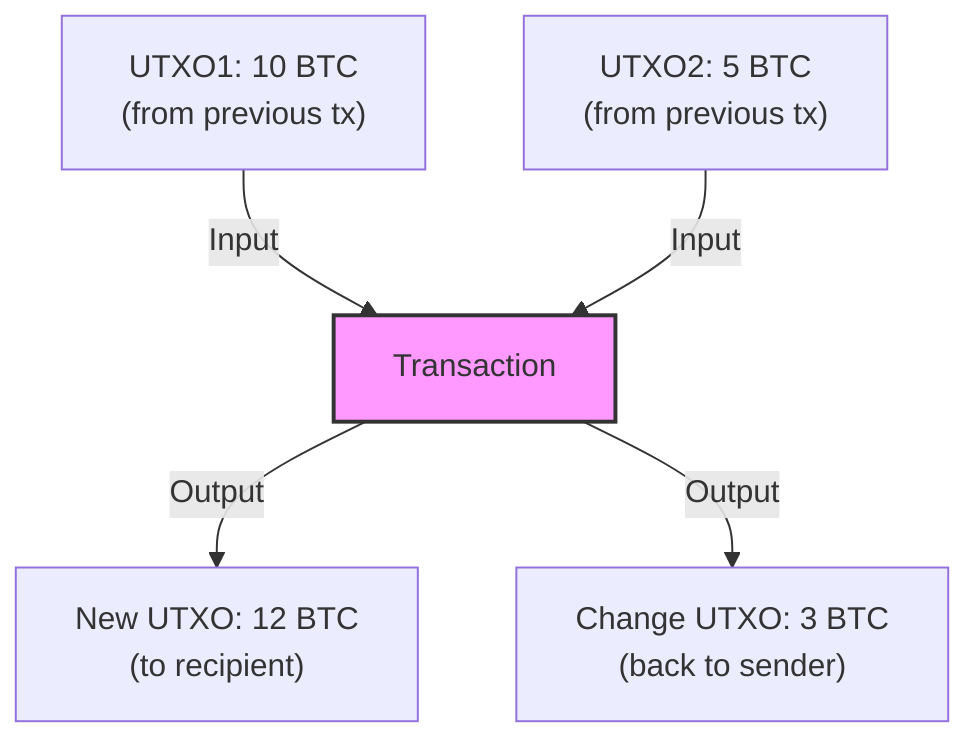
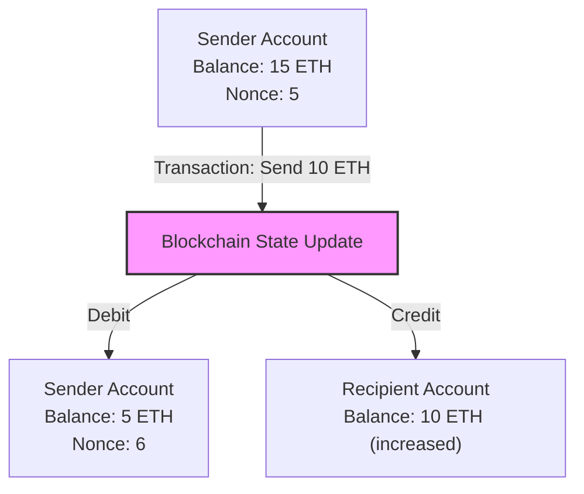
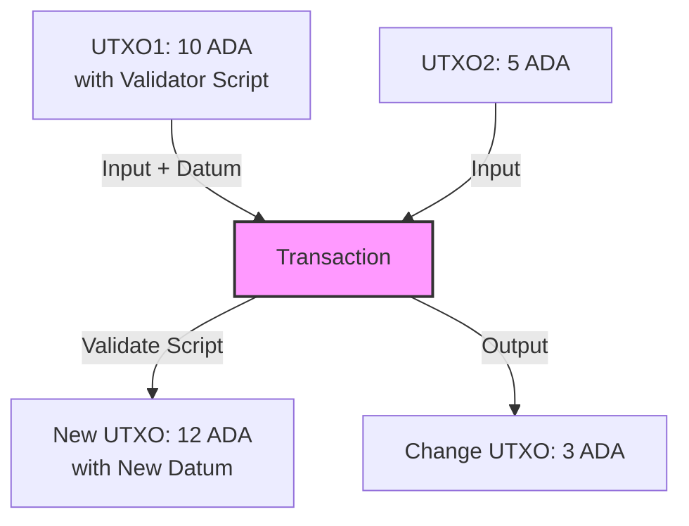
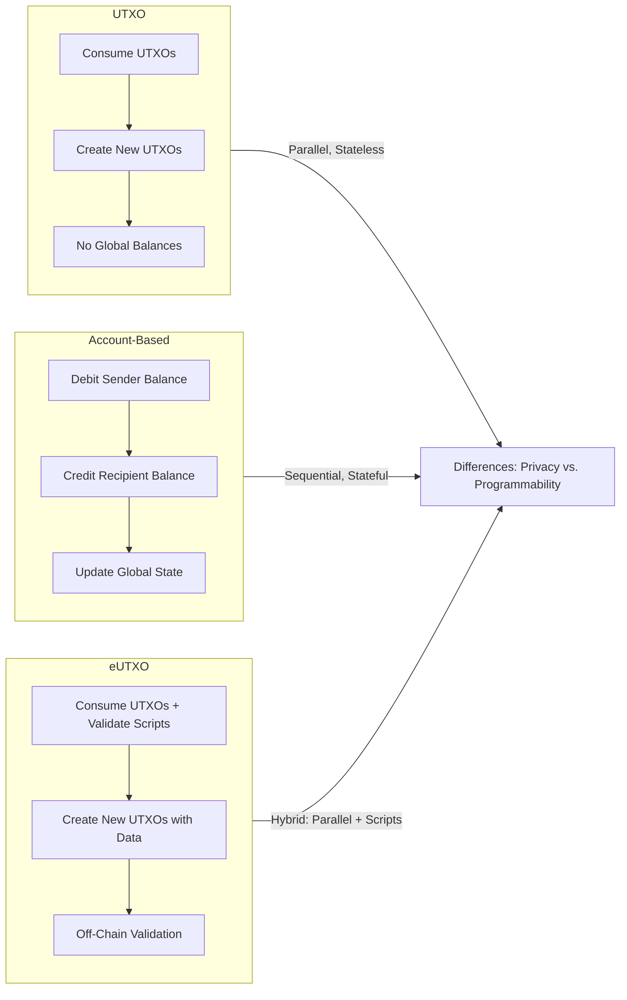

### UTXO Model
The Unspent Transaction Output (UTXO) model is a transaction accounting system primarily used in cryptocurrencies like Bitcoin. In this model, every transaction output represents a discrete "coin" or amount of cryptocurrency that has not yet been spent. These unspent outputs (UTXOs) are the building blocks of the ledger.

**How it works**: 

- Each transaction consumes one or more existing UTXOs as inputs (which must sum up to at least the amount being sent).
- It then creates new UTXOs as outputs: one for the recipient, and possibly "change" back to the sender if the input exceeds the sent amount.
- Spent UTXOs are removed from the pool, and new ones are added. The blockchain tracks all UTXOs globally, and a user's "balance" is the sum of UTXOs they control (via private keys).
- This model ensures no double-spending because each UTXO can only be spent once, verified through cryptographic signatures.

**Advantages**: High privacy (transactions don't directly link accounts), parallelism (transactions can be processed independently if they don't share UTXOs), and simplicity for verifying spendability.

**Disadvantages**: Can lead to UTXO bloat (many small outputs), higher storage requirements, and complexity in handling smart contracts due to stateless nature.

Here's a diagram illustrating a simple UTXO transaction flow:

### Account-Based Model

The Account-based model, popularized by Ethereum, treats the ledger like a bank account system. Each user or contract has an account with a balance, nonce (transaction counter to prevent replays), and possibly code/storage for smart contracts.

**How it works**:

- Accounts are either externally owned (controlled by private keys) or contract accounts (controlled by code).
- A transaction specifies a sender, recipient, amount, and optional data (for smart contracts). It debits the sender's balance and credits the recipient's, updating the global state.
- The blockchain maintains a state trie (a Merkle Patricia Trie) to track all account balances and states efficiently.
- Nonce ensures transactions are processed in order, preventing replays or out-of-order execution.

**Advantages**: Simpler for developers (balances are straightforward), better suited for smart contracts (stateful execution), and efficient for frequent small transactions.

**Disadvantages**: Lower privacy (account histories are easily traceable), potential for replay attacks without nonces, and sequential processing (transactions from the same account must be ordered), which can limit parallelism.

Here's a diagram for an Account-based transaction:

### Extended UTXO (eUTXO) Model
The eUTXO model is an extension of the traditional UTXO model, designed to support smart contracts while retaining UTXO benefits. It's used in Cardano.

- **How it works**:
&nbsp;&nbsp;- Builds on UTXO by attaching scripts (validators) to outputs, allowing conditional spending based on data, context, or state.
&nbsp;&nbsp;- Transactions can consume multiple UTXOs, validate scripts, and produce new ones with attached data.
&nbsp;&nbsp;- It introduces determinism: transaction validity can be checked off-chain before submission, reducing failures.
&nbsp;&nbsp;- Maintains a ledger of UTXOs but adds a global state view for contracts via off-chain indexing.

- **Advantages**: Combines UTXO parallelism and privacy with account-like programmability, better scalability for DeFi, and predictable fees (no gas wars).
&nbsp;&nbsp;
- **Disadvantages**: More complex scripting than pure accounts, potential for higher computation in validation.

Here's a diagram for an eUTXO transaction:

### Differences between Models
To highlight differences, here's a comparative flowchart showing how each model processes a transaction:

### Table Outlining Differences
| Aspect                  | UTXO Model                          | Account-Based Model                 | eUTXO Model                         |
|-------------------------|-------------------------------------|-------------------------------------|-------------------------------------|
| **State Representation**| Discrete unspent outputs (no accounts) | Balances in accounts                | UTXOs with attached scripts/data    |
| **Transaction Processing** | Consume inputs, create outputs; parallel if independent | Debit/credit balances; sequential per account | Consume/validate, create outputs; parallel with off-chain checks |
| **Double-Spending Prevention** | Each UTXO spent once               | Nonce for ordering                  | Each UTXO spent once + script validation |
| **Privacy**             | Higher (no persistent accounts)    | Lower (traceable balances)          | Higher (like UTXO)                  |
| **Smart Contract Suitability** | Limited (scripting is basic)       | High (stateful code execution)      | High (extended scripting)           |
| **Scalability**         | Good parallelism, but UTXO bloat   | Limited by sequential nonce         | Better parallelism than accounts    |
| **Examples**            | Bitcoin                            | Ethereum                            | Cardano                             |

### Connection to Current Blockchains
- **Bitcoin (UTXO)**: Bitcoin uses UTXO for its focus on being a simple, secure store of value. The model emphasizes immutability and prevents double-spending without complex state management, aligning with Bitcoin's design as "digital gold." It avoids account states to minimize attack surfaces and enhance verifiability in a decentralized network.

- **Ethereum (Account-Based)**: Ethereum adopted this model to enable Turing-complete smart contracts and decentralized applications (dApps). The stateful nature allows complex interactions like DeFi protocols, where contracts maintain persistent data. It's chosen for developer friendliness, though it leads to challenges like high gas fees during congestion—addressed in upgrades like Ethereum 2.0 for better scalability.

- **Cardano (eUTXO)**: Cardano uses eUTXO to blend UTXO's security and parallelism with smart contract capabilities. This supports its research-driven approach for sustainable, scalable DeFi and real-world applications (e.g., in Africa for identity and finance). The extension allows deterministic execution, reducing failed transactions and fees, which fits Cardano's emphasis on predictability and energy efficiency via proof-of-stake.

- **Other Blockchains**:

    - **Litecoin and Dogecoin (UTXO)**: Forked from Bitcoin, they prioritize fast, low-cost payments, leveraging UTXO's simplicity for everyday transactions without needing advanced programmability.

    - **Solana (Account-Based with modifications)**: Uses accounts for high-throughput dApps, but with a unique "Sealevel" runtime for parallel execution, chosen to achieve thousands of TPS for gaming and NFTs.
    - **Ergo (eUTXO variant)**: Focuses on secure financial contracts, using eUTXO for privacy-enhanced DeFi, aligning with its sigma-protocol-based scripting for complex but verifiable logic.

These models are selected based on the blockchain's goals: UTXO for security-focused value transfer, accounts for flexibility in ecosystems, and eUTXO for balanced scalability in next-gen platforms.

---

### XRP (Ripple Ledger)
The XRP Ledger, which powers the XRP cryptocurrency, follows an **account-based model** rather than a UTXO model. In this system, balances are tracked directly in accounts (similar to Ethereum), where transactions debit from the sender's account and credit the recipient's. This design supports Ripple's focus on fast cross-border payments and liquidity provision, allowing for efficient state management without the need for tracking individual unspent outputs. The account model enables features like payment channels and escrows, which are integral to Ripple's ecosystem.render

### XLM (Stellar)
Stellar Lumens (XLM) also uses an **account-based model**, akin to Ethereum. Accounts maintain balances, and transactions update these balances directly while incorporating a minimum balance requirement (currently around 0.5 XLM per base reserve) to prevent spam. This model suits Stellar's emphasis on affordable, inclusive financial services, such as remittances and asset tokenization, by simplifying multi-asset transactions and built-in decentralized exchange functionality.renderrenderrender

### XDC (XinFin Network)
The XDC Network follows an **account-based model**, as it is EVM-compatible and built on a hybrid architecture inspired by Ethereum and Quorum. Transactions operate by updating account balances, supporting smart contracts and decentralized applications. This choice aligns with XinFin's enterprise focus on trade finance and supply chain solutions, leveraging delegated proof-of-stake (XDPoS) for efficiency while maintaining compatibility with Ethereum tools for broader adoption.renderrenderrender

### Why These Blockchains Use the Account-Based Model
- **Alignment with Goals**: Unlike UTXO-based chains (e.g., Bitcoin) focused on simple value storage, XRP, XLM, and XDC prioritize complex financial operations like payments, asset issuance, and smart contracts. The account-based model simplifies state tracking for these features, making it easier to handle persistent data and sequential transactions.
- **Efficiency for Payments**: All three are designed for fast, low-cost transfers (e.g., cross-border for XRP and XLM, enterprise for XDC), where direct balance updates reduce complexity compared to managing UTXOs.
- **Smart Contract Support**: The model enables stateful execution, crucial for XDC's EVM compatibility and the programmable aspects in Stellar and Ripple.
- **Comparison to Other Models**: None use UTXO (like Bitcoin) or eUTXO (like Cardano), as those emphasize parallelism and privacy over the flexibility needed for their payment-centric ecosystems. This choice can limit parallelism but enhances developer accessibility for dApps and integrations.