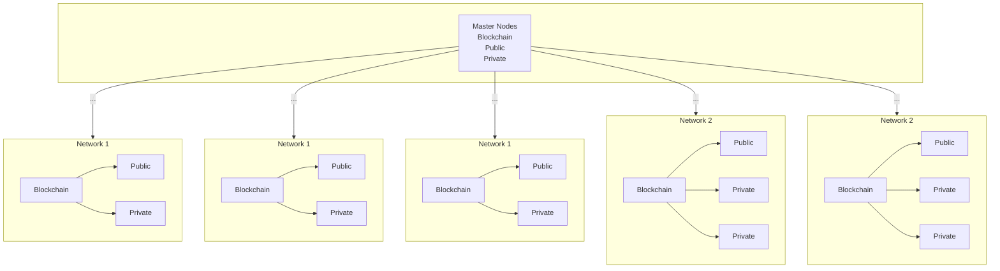
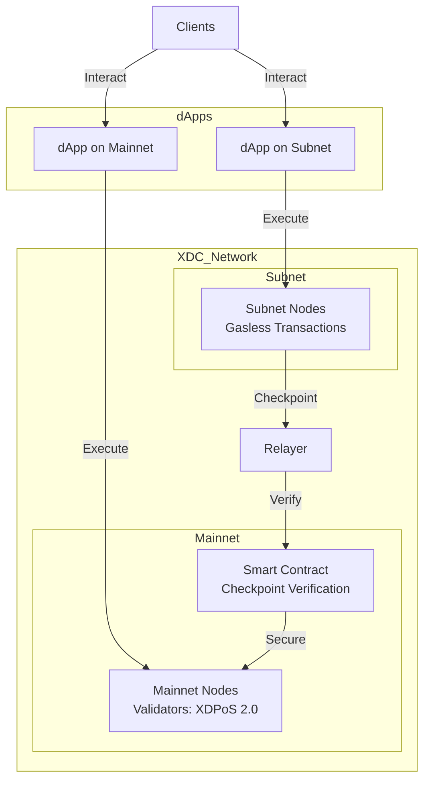

# XDC Network Gasless Subnet Overview

This is a generated response to the Whitepaper presented [here](https://xinfin.org/docs/whitepaper-xdc-gasless-subnet.pdf) on XDC Gasless Subnets.

## What is the XDC Gasless Subnet?
The XDC gasless subnet is a sovereign, permissioned blockchain network that operates as a Layer-2 solution within the XDC Network ecosystem. It replicates the features of the XDC mainnet, such as its Delegated Proof of Stake (DPoS) consensus mechanism (XDPoS 2.0), while allowing customization for specific enterprise or application needs. The "gasless" feature enables transactions without requiring users to pay gas fees in XDC tokens, as fees can be subsidized by the subnet operator or covered through alternative mechanisms, making it user-friendly for enterprise and consumer applications.

## XDC Network Architecture
The following diagram illustrates the XDC Network’s structure, showing how Master Nodes interact with various blockchain networks (Network 1 and Network 2), each containing public and private chains. This architecture underpins the gasless subnet’s ability to inherit security from the XDC mainnet while operating independently.

*Figure 1: The XDC Network*

##Clients and dApps in the XDC Ecosystem
Clients (end-users or entities) interact with the XDC Network through decentralized applications (dApps), which can be deployed on either the mainnet or a subnet. The mainnet provides a public, secure backbone, while subnets offer customized environments (e.g., gasless transactions, privacy). The diagram below shows how clients, dApps, subnets, and the mainnet interact, including the checkpointing process that ensures subnet security.

*Figure 2: Clients and dApps Interaction with Subnets and Mainnet*

## Benefits
1. **Cost Efficiency**: Eliminates gas fees for end-users, reducing transaction costs and making it attractive for high-frequency or micro-transaction use cases.[https://www.xdc.dev/gaslimit/how-do-i-get-an-rpc-url-for-my-subnet-3pc5](https://www.xdc.dev/gaslimit/how-do-i-get-an-rpc-url-for-my-subnet-3pc5)
2. **Privacy**: Subnets can be configured as private networks, ensuring data and transactions are accessible only to authorized parties, ideal for sensitive business applications.[https://test.xinfin.org/xdc-subnet](https://test.xinfin.org/xdc-subnet)
3. **Scalability**: Supports high-throughput, low-latency transactions, with the capacity for up to 2000 transactions per second, suitable for enterprise-grade applications.[https://xinfin.org/](https://xinfin.org/)
4. **Interoperability**: Enables cross-chain transactions and integration with legacy systems via bridges (e.g., Corda, Wanchain) and ISO 20022 compliance.[https://xinfin.org/](https://xinfin.org/)
5. **Security Inheritance**: Subnets checkpoint critical consensus data to the XDC mainnet, enhancing security by requiring an attacker to compromise both the subnet and the mainnet.[https://www.xinfin.io/xdc-subnet](https://www.xinfin.io/xdc-subnet)
6. **Customizability**: Allows tailored configurations (e.g., consensus rules, access controls) to meet specific business or application requirements.[https://www.xinfin.org/xdc-subnet](https://www.xinfin.org/xdc-subnet)
7. **Sovereignty**: Subnets are independently owned and operated, giving organizations full control over their infrastructure and data.[https://www.xinfin.io/xdc-subnet](https://www.xinfin.io/xdc-subnet)
8. **Enterprise-Friendly**: Supports tokenization of real-world assets (RWAs) and non-tangible assets, facilitating use cases like trade finance, decentralized finance (DeFi), and digital contracts.[https://coinmarketcap.com/currencies/xdc-network/](https://coinmarketcap.com/currencies/xdc-network/)

## Dependencies
1. **XDC Mainnet**: Subnets rely on the XDC mainnet for checkpointing consensus data to enhance security, requiring a stable and operational mainnet.[https://www.xinfin.io/xdc-subnet](https://www.xinfin.io/xdc-subnet)
2. **Infrastructure**: Operators need to set up and maintain nodes (e.g., validator or masternodes) for the subnet, which may require hardware or cloud resources.[https://web.archive.org/web/20200511161325/https://xinfin.org/resources.php](https://web.archive.org/web/20200511161325/https://xinfin.org/resources.php)
3. **Technical Expertise**: Configuring and managing a subnet requires knowledge of blockchain technology, Docker, and network setup (e.g., RPC endpoints, APIs).[https://www.xdc.dev/gaslimit/how-do-i-get-an-rpc-url-for-my-subnet-3pc5](https://www.xdc.dev/gaslimit/how-do-i-get-an-rpc-url-for-my-subnet-3pc5)
4. **XDC Ecosystem Tools**: Utilizes tools like XDC Remix, XDCScan, and XDCPay for development, monitoring, and wallet integration.[https://xinfin.org/xdc-chain-network-tools-and-documents](https://xinfin.org/xdc-chain-network-tools-and-documents)
5. **Community Support**: Relies on the XDC developer community for tools, documentation, and troubleshooting (e.g., XDC Forum, Telegram).[https://test.xinfin.org/xdc-subnet](https://test.xinfin.org/xdc-subnet)
6. **Relayer Program**: A relayer is needed to checkpoint subnet data to the mainnet, requiring integration with XDC mainnet smart contracts.[https://www.xinfin.io/xdc-subnet](https://www.xinfin.io/xdc-subnet)
7. **Regulatory Compliance**: For enterprise use, subnets may need to integrate KYC/AML features or comply with jurisdictional regulations.[https://github.com/XinFinOrg/XDPoSChain](https://github.com/XinFinOrg/XDPoSChain)

## Security Issues
1. **Subnet Node Compromise**: If subnet nodes are poorly secured (e.g., weak private key management), attackers could disrupt operations or manipulate transactions within the subnet.[https://test.xinfin.org/xdc-subnet](https://test.xinfin.org/xdc-subnet)
2. **Mainnet Dependency**: While subnets inherit mainnet security, a catastrophic failure or attack on the XDC mainnet could indirectly affect subnet trust.[https://www.xinfin.io/xdc-subnet](https://www.xinfin.io/xdc-subnet)
3. **Configuration Risks**: Incorrect subnet configurations (e.g., improper access controls) could lead to unauthorized access or data leaks.[https://www.xinfin.org/xdc-subnet](https://www.xinfin.org/xdc-subnet)
4. **Relayer Vulnerabilities**: The relayer program that checkpoints data to the mainnet could be a single point of failure if not properly secured.[https://www.xinfin.io/xdc-subnet](https://www.xinfin.io/xdc-subnet)
5. **Experimental Nature**: As an innovative project, the XDC Network carries risks of bugs or unforeseen vulnerabilities, especially in new features like gasless transactions.[https://www.xinfin.org/risk-warning-disclaimer](https://www.xinfin.org/risk-warning-disclaimer)
6. **Limited Validator Diversity**: With only 108 active validator masternodes (as of Jan 2025), centralization risks could impact mainnet security, indirectly affecting subnets.[https://coinmarketcap.com/currencies/xdc-network/](https://coinmarketcap.com/currencies/xdc-network/)

## Implementation Process
1. **Planning**:
   - Define use case (e.g., trade finance, digital asset tokenization, supply chain).
   - Determine subnet requirements (privacy, transaction volume, access control).
   - Assess hardware/cloud needs for hosting subnet nodes.
2. **Setup Infrastructure**:
   - Install Docker and required dependencies on hosting machines.[https://web.archive.org/web/20200511161325/https://xinfin.org/resources.php](https://web.archive.org/web/20200511161325/https://xinfin.org/resources.php)
   - Deploy subnet nodes using XDC Network’s node setup scripts (available on GitHub: https://github.com/XinFinOrg/XinFin-Node).[https://xinfin.org/xdc-chain-network-tools-and-documents](https://xinfin.org/xdc-chain-network-tools-and-documents)
   - Configure subnet parameters (e.g., consensus rules, gasless transaction settings).
3. **Integration with XDC Mainnet**:
   - Set up a relayer program to checkpoint consensus data to the XDC mainnet.[https://www.xinfin.io/xdc-subnet](https://www.xinfin.io/xdc-subnet)
   - Deploy a smart contract on the mainnet to verify and record checkpoints.[https://www.xinfin.io/xdc-subnet](https://www.xinfin.io/xdc-subnet)
4. **Development**:
   - Use XDC Remix to write and deploy smart contracts for the subnet.[https://xinfin.org/xdc-chain-network-tools-and-documents](https://xinfin.org/xdc-chain-network-tools-and-documents)
   - Integrate with XDC APIs for wallet support (e.g., XDCPay) and transaction monitoring (e.g., XDCScan).[https://xinfin.org/xdc-chain-network-tools-and-documents](https://xinfin.org/xdc-chain-network-tools-and-documents)
   - Enable gasless transactions by configuring the subnet to subsidize fees (e.g., via a master account).[https://www.xdc.dev/gaslimit/how-do-i-get-an-rpc-url-for-my-subnet-3pc5](https://www.xdc.dev/gaslimit/how-do-i-get-an-rpc-url-for-my-subnet-3pc5)
5. **Testing**:
   - Test the subnet on the Apothem TestNet to ensure functionality and performance.[https://web.archive.org/web/20200511161325/https://xinfin.org/resources.php](https://web.archive.org/web/20200511161325/https://xinfin.org/resources.php)
   - Validate gasless transactions using tools like web3.js or ethers.js.[https://www.xdc.dev/gaslimit/how-do-i-get-an-rpc-url-for-my-subnet-3pc5](https://www.xdc.dev/gaslimit/how-do-i-get-an-rpc-url-for-my-subnet-3pc5)
6. **Deployment**:
   - Launch the subnet on the XDC mainnet.
   - Monitor node uptime, gas limits, and transaction activity using XinFin Explorer or custom tools.[https://web.archive.org/web/20200511161325/https://xinfin.org/resources.php](https://web.archive.org/web/20200511161325/https://xinfin.org/resources.php)
7. **Maintenance**:
   - Regularly update subnet software to align with XDC Network upgrades (e.g., XDC 2.0).[https://coinmarketcap.com/currencies/xdc-network/](https://coinmarketcap.com/currencies/xdc-network/)
   - Engage with the XDC community for support via the XDC Forum or Telegram.[https://test.xinfin.org/xdc-subnet](https://test.xinfin.org/xdc-subnet)

## Applicability to Non-Tangible Business Services and Products
The XDC gasless subnet is highly suitable for non-tangible business services and products due to its flexibility, privacy, and cost-efficiency. Examples include:
1. **Digital Contracts and Agreements**:
   - Smart contracts on subnets can automate non-tangible services like legal agreements, licensing, or subscription services, with gasless transactions reducing user friction.
   - Example: A SaaS platform could use a subnet to manage subscription renewals without transaction fees.
2. **Decentralized Finance (DeFi)**:
   - Subnets can tokenize financial instruments (e.g., bonds, invoices) or create digital assets for DeFi applications, ensuring privacy for institutional users.[https://coinmarketcap.com/currencies/xdc-network/](https://coinmarketcap.com/currencies/xdc-network/)
   - Example: Tokenizing intellectual property rights for royalty distribution.
3. **Data Privacy Services**:
   - Subnets can secure sensitive non-tangible data (e.g., customer analytics, proprietary algorithms) with private access controls.
   - Example: A healthcare analytics firm could use a subnet to process patient data anonymously.
4. **Digital Identity and Credentials**:
   - Subnets can manage verifiable credentials (e.g., certifications, digital IDs) with gasless transactions for seamless user access.
   - Example: A university issuing blockchain-based diplomas on a subnet.
5. **Cross-Border Payments**:
   - Gasless subnets can facilitate fast, low-cost payments for non-tangible services (e.g., consulting, freelancing) with ISO 20022 compliance.[https://xinfin.org/](https://xinfin.org/)
   - Example: A global consulting firm settling invoices instantly via tokenized payments.
6. **Gaming and Virtual Goods**:
   - Subnets can support non-tangible assets like in-game currencies or NFTs, with gasless transactions enhancing user experience.
   - Example: A gaming platform issuing virtual collectibles on a subnet.

## Conclusion
The XDC gasless subnet offers a powerful, customizable blockchain solution for enterprises and developers, particularly for non-tangible services and products. Its cost-efficiency, privacy, and interoperability make it ideal for applications like DeFi, digital contracts, and data services. However, careful configuration and ongoing maintenance are critical to mitigate security risks and ensure robust performance. For detailed setup guides, refer to the XDC Network documentation (https://docs.xdc.network) or community resources ([https://www.xdc.dev](https://www.xdc.dev)).[https://docs.xdc.network/](https://docs.xdc.network/)
