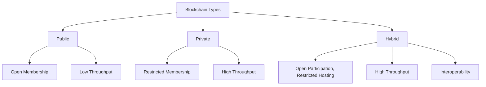
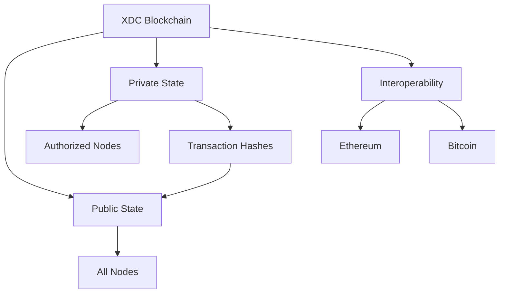
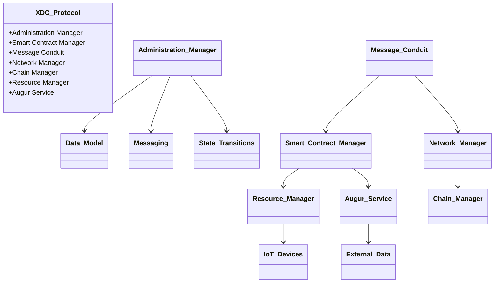
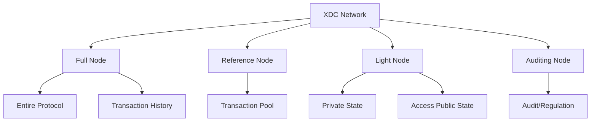
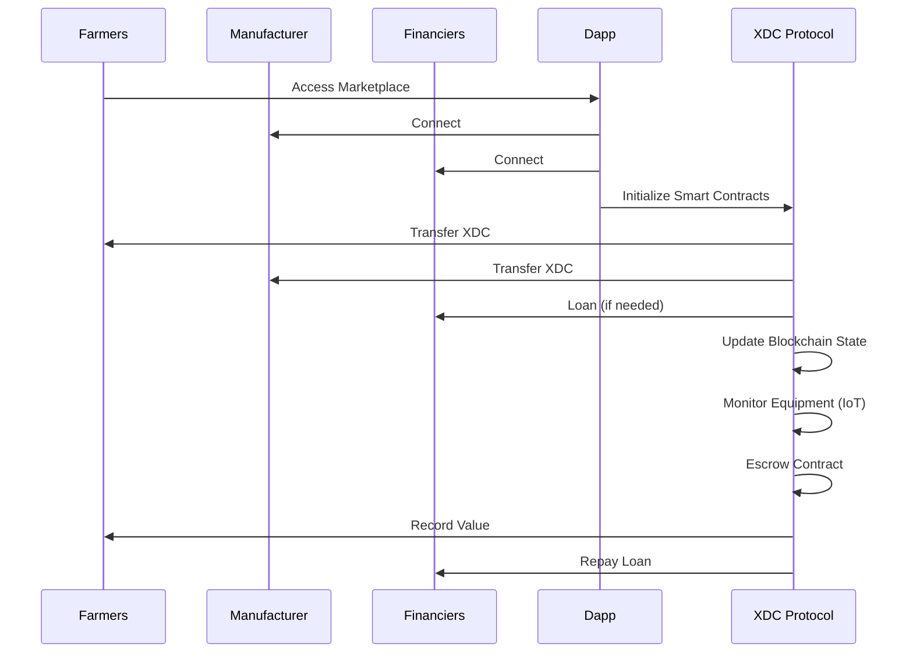

# Summary of The XDC Protocol Technical Whitepaper

Link to Whitepaper: [https://github.com/DersonProductions/Crypto-Things/blob/main/XDC/whitepaper-tech.pdf](https://github.com/DersonProductions/Crypto-Things/blob/main/XDC/whitepaper-tech.pdf)

NOTE: This is a generated summary

The XDC Protocol, developed by XinFin Organization, is a hybrid blockchain designed to address the limitations of public and private blockchains for enterprise applications, particularly in global trade and finance. Published in September 2017, the whitepaper outlines the architecture, components, and use cases of the XDC blockchain, which combines the benefits of public and private blockchain paradigms to offer high security, auditability, and interoperability.

## 1. Blockchain Paradigm

The whitepaper introduces blockchain as a distributed cryptographic ledger maintained by a network of computers, enabling immutable transaction records. It highlights Bitcoin as the most successful blockchain application, emphasizing its privacy, automation, and decentralization features. The XDC Protocol builds on these principles but adapts them for regulated industries.

### Public vs. Private vs. Hybrid Blockchains

The whitepaper compares blockchain types:

| Parameters            | Public Blockchain | Private Blockchain | Hybrid Blockchain |
|-----------------------|-------------------|--------------------|-------------------|
| Transactional Visibility | Fully visible     | Not visible        | Both; subject to use case |
| Auditability          | Low               | Low to High        | High              |
| Network               | Decentralized     | Centralized        | Hybrid            |
| Security              | Compromised       | High               | High              |
| Throughput            | Low (3-4 s⁻¹ Bitcoin; 15 s⁻¹ Ethereum) | Very high          | Very High         |
| Membership            | Open to all       | Restricted         | Participation Open, Hosting Restricted |
| Interoperability      | No                | No                 | Yes               |

**Diagram: Blockchain Comparison**

## 2. The XDC Blockchain

The XDC blockchain is a consortium-based hybrid blockchain forked from Quorum, a permissioned blockchain built on Ethereum. It addresses the limitations of public blockchains like Ethereum, which are unsuitable for enterprise use due to data visibility and auditability issues.

### 2.1 Why Not Vanilla Ethereum?

Public blockchains expose transaction data, risking de-anonymization, and lack auditability for enterprise needs. XDC ensures data security and auditability by running nodes on vetted consortium members’ infrastructure.

### 2.2 Hybrid Network Architecture

XDC supports both public and private network states. The public state is shared across all nodes, while private states are restricted to authorized members. Hashes of private transactions are stored on the public state for immutability.

**Diagram: XDC Network Architecture**

### 2.3 Consortium Membership

XDC has three membership tiers:
- **Tier 1**: Accessible by owning XDC tokens.
- **Tier 2 & 3**: Require holding specific XDC amounts and vetting to host nodes and participate in consensus.

Fork prevention is ensured through asset forfeiture rules and block signing by nodes.

### 2.4 XDC Blockchain Architecture

The architecture comprises several components:

- **Administration Manager**: Defines data models, messaging, and state transitions using a JavaScript CLI.
- **Smart Contract Manager**: Executes contracts, interfacing with Resource Manager and Augur Services.
- **Message Conduit**: Connects protocol components for secure data transmission.
- **Network Manager**: Manages node connections and permissioned subnetworks.
- **Chain Manager**: Handles consensus and Byzantine Fault Tolerance (BFT).
- **Resource Manager**: Connects to IoT devices for resource monitoring.
- **Augur Service**: Acts as an oracle for external data.

**Diagram: XDC Blockchain Components**

### 2.5 Forking Quorum

XDC is built on Quorum, leveraging Ethereum’s smart contract functionality and QuorumChain’s consensus mechanism. Improvements include higher transaction throughput, a smart contract manager for interoperability, and punitive contracts to ensure node honesty.

### 2.6 XDC Nodes

The XDC network includes four node types:
- **Full Node**: Hosts the entire protocol and transaction history, restricted to vetted members.
- **Reference Node**: Transfers transactions to the pool with minor verification.
- **Light Node**: Stores private state locally, accessing public state via full nodes.
- **Auditing Node**: Limited functionality for regulation and auditing.

**Diagram: XDC Node Types**

### 2.7 Design Considerations

- **Tokens**: XDC uses the ERC20 standard for compatibility with Ethereum Dapps.
- **Wallet Security**: Light wallets ensure secure key management.
- **XDC01 Standard**: A custom token standard to prevent accidental transfers to incompatible blockchains.

## 3. Real-World Use Case

The whitepaper describes a use case involving farmers in Ghana purchasing a harvester from an Indian manufacturer, facilitated by smart contracts and IoT monitoring.

**Steps**:
1. A Dapp connects farmers, manufacturers, and financiers, initializing smart contracts.
2. The Administration Manager processes transaction data.
3. Smart contracts transfer XDC funds, potentially via a loan.
4. IoT monitoring ensures equipment usage compliance.
5. Escrow contracts protect against non-payment.
6. The blockchain records value generated and loan repayment.

**Diagram: Use Case Flow**

## 4. Blockchain Applications

- **Asset Valuation and Financing**: Tracks asset value (e.g., airplanes) using smart contracts.
- **Resource Monitoring**: IoT devices monitor assets for financing and compliance.
- **Smart Contracts**: Audited contracts ensure security and standardization.
- **Marketplace of Smart Contracts**: A regulated platform for audited contracts.

## 5. Conclusion

The XDC blockchain bridges public and private blockchain advantages, offering interoperability, security, and enterprise readiness. It addresses the limitations of public blockchains (e.g., transaction visibility) and private blockchains (e.g., lack of interoperability) through a hybrid model, tiered membership, and robust consensus mechanisms.
