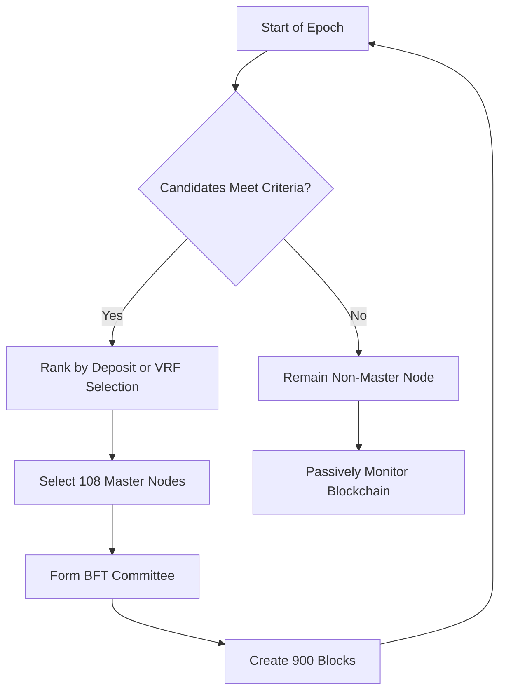
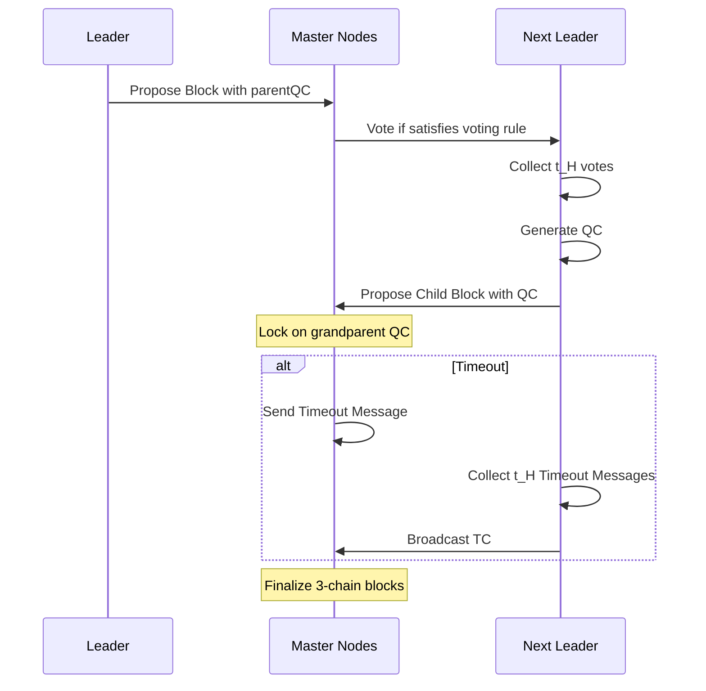
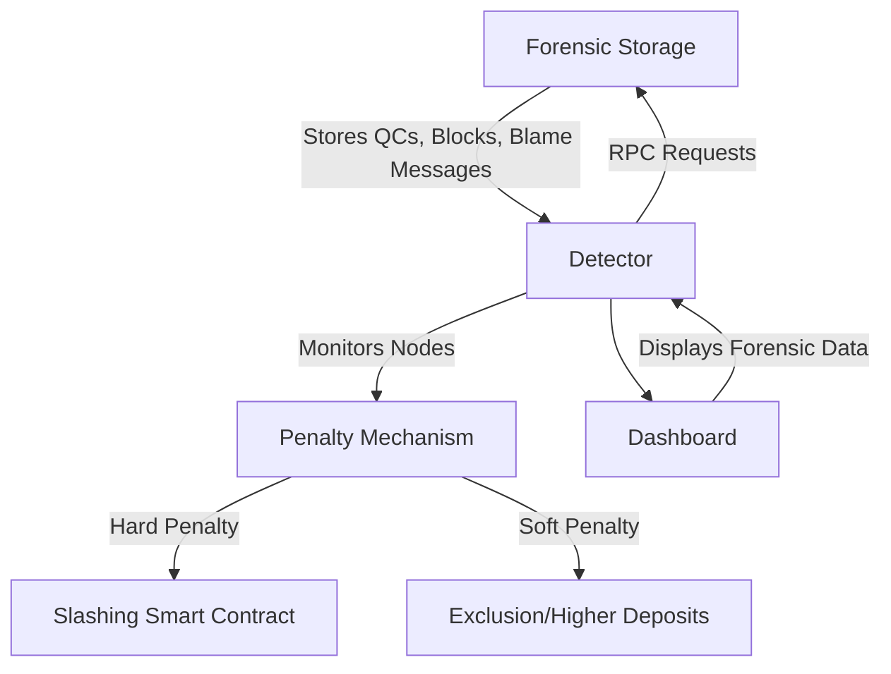

# XinFin XDPoS 2.0: Accountability and Forensics in Blockchain

## Introduction

The XinFin Delegated Proof-of-Stake (XDPoS) 2.0 is an advanced consensus engine designed for the XDC Network, aiming to deliver military-grade security, high performance, and low resource consumption. This whitepaper, authored by Gerui Wang, Jerome Wang, Liam Lai, and Fisher Yu from Hash Laboratories in August 2021, introduces XDPoS 2.0, which integrates the state-of-the-art Byzantine Fault-Tolerant (BFT) HotStuff protocol with a novel forensic monitoring system. This upgrade ensures backwards compatibility and paves the way for enterprise adoption in industries like trade finance by introducing accountability and judiciary-like mechanisms to blockchain systems.

This document provides a user-friendly overview of the whitepaper, explaining its key components, including master node election, the HotStuff consensus protocol, reward mechanisms, and the innovative forensic monitoring feature. It also contextualizes XDPoS 2.0 within the evolution of blockchain technology and its potential to transform decentralized trust systems.

## Evolution of Blockchain Technology

The whitepaper situates XDPoS 2.0 as part of the "Blockchain 4.0" era, building on previous blockchain generations:

- **Blockchain 1.0 (Bitcoin, Proof of Work)**: Introduced a secure, permissionless ledger using Proof of Work (PoW). However, it suffers from high energy consumption and low throughput (a few transactions per second) with long confirmation times (hours).
- **Blockchain 2.0 (Ethereum, Smart Contracts)**: Added programmable smart contracts via the Ethereum Virtual Machine (EVM), maintaining PoW’s security but inheriting its scalability issues.
- **Blockchain 3.0 (Proof of Stake)**: Adopted Proof of Stake (PoS) protocols like Ouroboros, Algorand, and HotStuff, improving throughput and latency while reducing energy use. These protocols ensure Byzantine Fault Tolerance (BFT), guaranteeing consensus if less than one-third of participants are malicious.
- **Blockchain 4.0 (XDPoS 2.0)**: Introduces forensic monitoring and accountability, mimicking a judiciary system to identify and penalize malicious actors, making it suitable for enterprise applications like trade finance.

The security of blockchains is defined by their ability to tolerate Byzantine faults. For instance, Bitcoin’s PoW requires over 50% honest hash power, while PoS systems like Algorand and HotStuff tolerate up to one-third malicious participants. Mathematically, the security threshold is expressed as:

$$
\text{Security guaranteed if } \frac{\text{Honest participants}}{\text{Total participants}} > x
$$

Where $\( x = 0.5 \)$ for PoW (Bitcoin) and $\( x = \frac{1}{3} \)$ for PoS (Algorand, HotStuff).

## XDPoS 2.0 Overview

XDPoS 2.0 is built on three pillars: **Master Node Election**, **HotStuff Consensus Engine**, and **Reward Mechanism**. It introduces forensic monitoring to enhance accountability, addressing the absence of a judiciary system in traditional blockchains.

### 1. Master Node Election

Master nodes are responsible for creating and approving blocks. To become a master node candidate, a node must meet strict criteria:

- Deposit at least 10,000,000 XDC into a smart contract.
- Use a secure wallet (preferably hardware-based).
- Maintain dedicated hardware with a static public IP, 100% uptime, and a tier 3+ data center environment.
- Optionally use a Virtual Private Server (VPS) or cloud services like Amazon EC2 M3 or Microsoft Azure.

The election process occurs at the start of each **epoch** (a period of 900 blocks). A set of 108 master nodes is selected from candidates, forming a BFT committee. The selection can use:

1. **Ranking by deposit**: Select the top 108 candidates by stake size.
2. **Verifiable Random Functions (VRFs)**: Randomly select 108 candidates, with probability proportional to their deposit.

Initially, XDPoS 2.0 uses the ranking method for compatibility, with plans to adopt VRFs for fairness. Non-elected nodes passively monitor the blockchain.

**Diagram: Master Node Election Process**

### 2. HotStuff Consensus Engine

The HotStuff protocol is a BFT state machine replication (SMR) protocol that ensures **deterministic finality** (no forking) and **resilience to network asynchrony**. It operates in rounds, with a leader proposing blocks and collecting votes from master nodes.

#### Protocol Mechanics

- **Committee**: The 108 master nodes form the BFT committee, ordered by account address.
- **Rounds**: Each round has a leader (chosen round-robin) who proposes a block. The block includes a **Quorum Certificate (QC)** for the parent block, requiring votes from at least $\( t_H = \lceil \text{VALIDATOR_SET_SIZE} \times \frac{2}{3} \rceil = \lceil 108 \times \frac{2}{3} \rceil = 72 \)$ nodes.
- **Data Structures**:
  - **Block**: Contains a `parentQC` field in the header, linking to the parent block’s QC.
  - **QC**: Includes the round number, block hash, and signatures from $\( t_H \)$ voters.
  - **Timeout Certificate (TC)**: Formed if $\( t_H \)$ nodes report a timeout, skipping a round.
- **Rules**:
  - **Leader Proposal**: The leader proposes a block with the latest QC.
  - **Locking Rule**: Nodes lock on the grandparent block’s QC, ignoring non-descendant blocks.
  - **Voting Rule**: Nodes vote for a block if it or its ancestor is locked, unless a newer round’s QC is presented.
  - **Finalization Rule**: A 3-chain (three consecutive blocks with QCs) finalizes the first block and its ancestors.
  - **Timeout Handling**: Nodes send timeout messages if no proposal is received, forming a TC to advance rounds.

**Diagram: HotStuff Protocol Flow**

#### Safety and Liveness

- **Safety**: Ensures all honest nodes agree on the same blockchain. With less than one-third Byzantine nodes, no conflicting QCs can form within or across rounds due to the locking and voting rules.
- **Liveness**: Guarantees progress when the leader is honest, the network is synchronous, and less than one-third of nodes are malicious. A 3-chain finalizes blocks in four rounds.

#### Performance

HotStuff achieves a **block finalization latency** of 6 seconds (3 block arrival times, each 2 seconds) under optimistic conditions. The QC size is small (e.g., 4.68 kB for 108 nodes), negligible compared to typical block sizes (e.g., 60 kB for Ethereum).

### 3. Reward Mechanism

Blocks are finalized in 6 seconds, allowing instant reward distribution to master nodes. The reward structure remains unchanged from XDPoS 1.0, incentivizing node participation.

### 4. Forensic Monitoring

XDPoS 2.0 introduces a judiciary-like system through forensic monitoring, enabling the identification and penalization of malicious nodes. This addresses **safety violations** (e.g., forking) and **liveness violations** (e.g., underperforming nodes).

#### Safety Violation

If over one-third of master nodes are Byzantine, they can create forks. However, these actions require signed messages, which are embedded in the blockchain. The forensic system identifies culpable nodes via **quorum intersections**:

$$
\text{Intersection size} = \text{VALIDATOR_SET_SIZE} / 3 \approx 108 / 3 = 36
$$

At least 36 Byzantine nodes can be identified, with proof from two honest nodes holding conflicting blockchains. Penalties (e.g., slashing deposits) are enforced via a governance-driven smart contract.

#### Liveness Violation

Underperforming nodes (e.g., failing to propose or vote) can slow the blockchain. These actions lack cryptographic evidence, so nodes broadcast **blame messages**, which are reviewed by the governance mechanism for penalties like exclusion from elections or increased deposit requirements.

#### Implementation

The forensic module includes:

- **Forensic Storage**: Stores QCs, blocks, and blame messages, accessible via RPC requests.
- **Detector**: Monitors nodes and reports violations to the penalty mechanism.
- **Penalty Mechanism**: Enforces hard (slashing) or soft (exclusion, higher deposits) penalties.

**Diagram: Forensic Monitoring Structure**

## Seamless Upgrade Plan

The upgrade to XDPoS 2.0 is designed to be seamless:

1. **Testing**: Three months of testing in Devnet and public testnet.
2. **Integration**: Release inactive XDPoS 2.0 updates to nodes.
3. **Activation**: Announce a block number for XDPoS 2.0 activation, ensuring no interruptions.
4. **Compatibility**: Maintains existing wallets, stakes, transactions, and APIs.

## Benefits for Trade Finance

XDPoS 2.0 targets enterprise adoption, particularly in trade finance, by offering:

- **Security**: Tolerates up to one-third malicious nodes with zero forking.
- **Performance**: 2-second block time, 6-second transaction finalization.
- **Accountability**: Forensic monitoring ensures malicious actors are identified and penalized.
- **Cost Efficiency**: Eliminates resource-intensive mining, reducing operational costs.

This makes the XDC Network ideal for disintermediating trade finance, providing competitive funding rates and visibility for SMEs and infrastructure projects.

## Conclusion

XDPoS 2.0 represents a significant evolution in blockchain technology, introducing a judiciary-like forensic system to ensure accountability. By integrating the HotStuff protocol with advanced monitoring, it achieves military-grade security, high performance, and enterprise readiness. As Blockchain 4.0, it sets a new standard for decentralized trust systems, particularly for trade finance, fostering widespread adoption.

## Links

[https://xinfin.org/xdpos](https://xinfin.org/xdpos)
[https://github.com/DersonProductions/Crypto-Things/blob/main/XDC/XDPoS%202.0%202108.01420v3.pdf](https://github.com/DersonProductions/Crypto-Things/blob/main/XDC/XDPoS%202.0%202108.01420v3.pdf)
