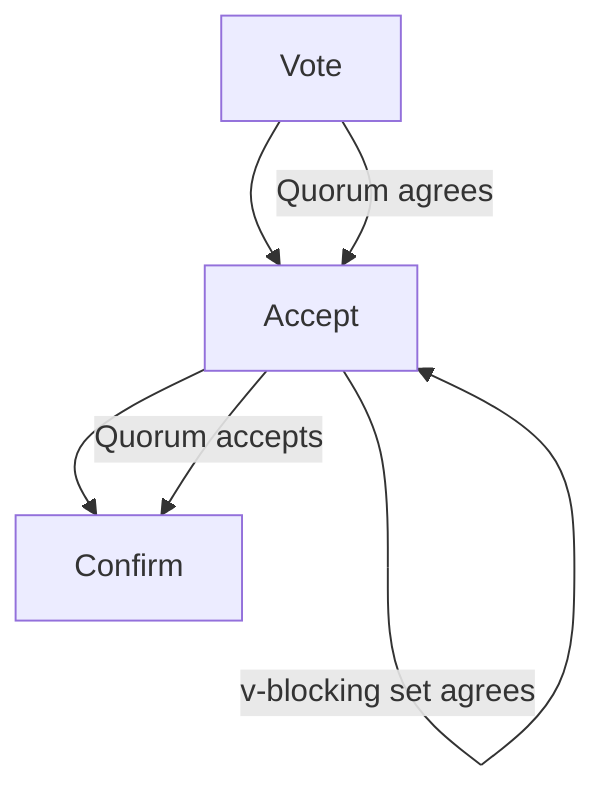
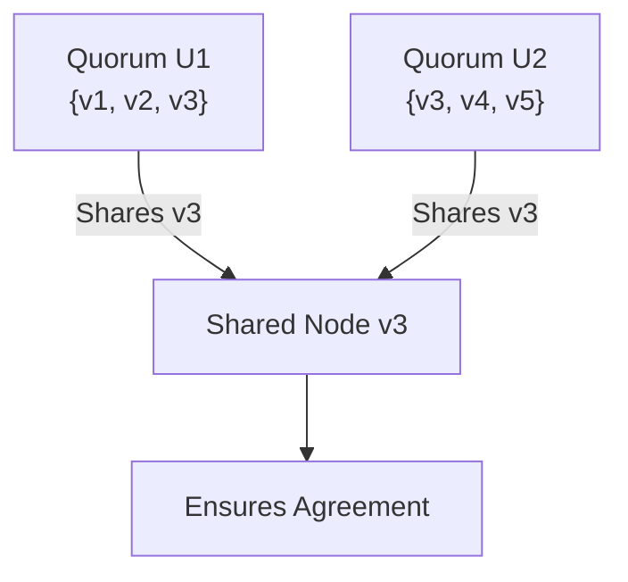

# Understanding the Stellar Consensus Protocol (SCP) in Simple Terms

The **Stellar Consensus Protocol (SCP)** is a way for computers (called nodes) in the Stellar network to agree on financial transactions quickly and securely, without needing a central authority like a bank. This document explains SCP in plain language, using examples, diagrams, and some math to make it clear for everyone. We'll also cover how it powers the Stellar network, a global system for fast and cheap payments.

---

## What is the Stellar Network?

Stellar is a blockchain-based platform designed to make international money transfers fast, cheap, and accessible to everyone [1]. Imagine sending $5 to a friend in another country in seconds, with a fee of less than a penny. Stellar achieves this by:

- Allowing anyone to join the network and issue digital tokens (like digital dollars or euros).
- Ensuring transactions are final and can't be reversed by mistake.
- Enabling atomic trades, meaning you can swap different tokens (e.g., USD for EUR) in one go without risk [2].

SCP is the heart of Stellar, ensuring all nodes agree on which transactions are valid. It’s like a group of friends agreeing on a shared grocery list, even if some might try to cheat.

---

## Why Do We Need Consensus?

In a global payment network, computers (nodes) need to agree on the state of the ledger—a record of all accounts and transactions. Without agreement, one node might think you have $100, while another thinks you have $50, causing chaos. SCP solves this by making sure all honest nodes agree on the same ledger, even if some nodes fail or act maliciously.

Traditional systems like banks use a central authority to keep everyone in sync, but this is slow and expensive for international payments. Other blockchains, like Bitcoin, use proof-of-work, which is energy-intensive and slow (taking minutes to confirm transactions) [3]. SCP offers a faster, greener alternative.

---

## How Does SCP Work?

SCP is based on **Federated Byzantine Agreement (FBA)**, a new model for consensus introduced by David Mazières in his 2016 whitepaper [4]. Here’s how it works in simple terms:

### 1. **Nodes and Quorum Slices**

Each node in the Stellar network chooses a set of other nodes it trusts, called its **quorum slices**. A quorum slice is like a group of friends you rely on to make decisions. For example, a node might say, “I trust nodes A, B, and C, and I’ll agree with them if at least two of them agree.”

- **Definition**: A **quorum** is a group of nodes that includes at least one quorum slice for each of its members. It’s the minimum set needed to reach agreement.
- **Math**: If a node $\( v \)$ has quorum slices $\( \mathbf{Q}(v) \)$, a set $\( U \)$ is a quorum if:
  $$
  \forall v \in U, \exists q \in \mathbf{Q}(v) \text{ such that } q \subseteq U
  $$
  This means every node in $\( U \)$ has a trusted slice fully contained in $\( U \)$ [4, p. 4].

### 2. **Federated Voting**

Nodes use a process called **federated voting** to agree on statements, like “Transaction X is valid.” It has three phases:

- **Voting**: A node votes for a statement if it thinks it’s valid and doesn’t conflict with other votes.
- **Accepting**: A node accepts a statement if either:
  - It’s part of a quorum where everyone votes for or accepts the statement.
  - A **v-blocking set** (a group that overlaps all of the node’s slices) accepts it, overriding the node’s own vote.
- **Confirming**: A node confirms a statement when its entire quorum accepts it.

**Example**: Imagine five nodes $(1, 2, 3, 4, 5)$. Node 1’s quorum slice is ${1, 2, 3}$. If nodes 2 and 3 vote for “Transaction X is valid,” node 1 accepts it. If all three confirm it, the transaction is settled.

**Diagram**: Federated Voting Process

### 3. **Balloting**

SCP organizes consensus into **ballots**, which are attempts to agree on a transaction set. Each ballot has:

- A **prepare phase**: Nodes propose a value (e.g., a set of transactions) and check it doesn’t conflict with past decisions.
- A **commit phase**: Nodes agree to finalize the value.

If nodes can’t agree, they time out and try a higher-numbered ballot. This ensures progress even if some nodes are slow or faulty.

**Math**: For a ballot $\( \langle n, x \rangle \)$, where $\( n \)$ is the ballot number and $\( x \)$ is the transaction set:
- **Prepare** statement: $\( \text{PREPARE} \langle n, x \rangle \)$ means no other value than $\( x \)$ will be decided in ballots $\( \leq n \)$.
- **Commit** statement: $\( \text{COMMIT} \langle n, x \rangle \)$ means $\( x \)$ is decided in ballot $\( n \)$.
- A prepare statement conflicts with a commit if $\( n \geq n' \)$ and $\( x \neq x' \)$ [5, p. 6].

### 4. **Nomination**

Before balloting, nodes use a **nomination protocol** to suggest transaction sets. Nodes propose values, and a leader selection process (using cryptographic hashes) reduces the number of proposals. Over time, nodes converge on a single value.

**Example**: If nodes propose different transaction sets, the leader’s proposal is prioritized, and others align with it.

---

## Key Features of SCP

SCP stands out because it combines four properties [4, p. 2]:

1. **Decentralized Control**: Anyone can join the network without permission, unlike traditional systems where a central authority sets the rules.
2. **Low Latency**: Transactions are confirmed in seconds, not minutes, making it practical for payments.
3. **Flexible Trust**: Nodes choose whom to trust, allowing small organizations to influence larger ones.
4. **Asymptotic Security**: SCP uses digital signatures and hashes, which can be made strong enough to resist even powerful attackers.

---

## Safety and Liveness

SCP ensures two key properties:

- **Safety**: No two honest nodes agree on conflicting transactions (e.g., double-spending). This requires **quorum intersection**, meaning any two quorums share at least one honest node.

$$
\text{For quorums } U_1, U_2: U_1 \cap U_2 \neq \emptyset
$$

  If ill-behaved nodes are removed, the remaining nodes must still have quorum intersection [4, p. 8].

- **Liveness**: Honest nodes can keep processing new transactions without being blocked by failed nodes, as long as they have a quorum slice of honest nodes.

**Diagram**: Quorum Intersection

---

## How Stellar Uses SCP

Stellar’s ledger is a database of accounts, balances, and transactions, updated every 5 seconds using SCP [5, p. 8]. Here’s how it works:

- **Accounts**: Each account has a public key and can hold assets like USD or XLM (Stellar’s native token).
- **Trustlines**: Users must consent to hold an asset, preventing spam.
- **Transactions**: Operations like payments or trades are grouped into transactions, which SCP confirms atomically.
- **Order Book**: Stellar’s built-in market lets users trade assets directly, with path payments for cross-currency trades (e.g., USD to EUR via XLM).

**Example**: To send $0.50 from the US to Mexico:
1. A US anchor issues digital USD tokens.
2. You send USD tokens to a Mexican account via a path payment, possibly converting through XLM.
3. SCP confirms the transaction in ~5 seconds.
4. The recipient’s anchor converts the tokens to pesos at an ATM [5, p. 11].

---

## Real-World Performance

Stellar has been running since 2015, handling millions of accounts and thousands of transactions daily. Key stats [5, p. 12]:

- **Accounts**: Over 3.3 million accounts.
- **Transaction Rate**: ~4.5 transactions/second, with peaks of complex transactions.
- **Latency**: Consensus takes ~1 second on average, ledger updates ~46 milliseconds.
- **Cost**: Running a validator costs ~$40/month on modest hardware.

In experiments, Stellar scaled to 50 million accounts and 500 transactions/second with minimal latency increase [5, p. 13].

---

## Challenges and Limitations

While SCP is powerful, it has challenges [4, p. 28]:

- **Configuration Errors**: Nodes must choose quorum slices carefully. Poor choices can lead to disagreements or halts [5, p. 10].
- **Liveness Risks**: Malicious nodes can delay progress by timing attacks, requiring manual slice adjustments [5, p. 7].
- **No Guaranteed Termination**: In rare cases, SCP may face delays if nodes don’t synchronize, though randomness could help [4, p. 27].

Stellar addresses these with tools to detect risky configurations and simpler setup options [5, p. 11].

---

## Why SCP Matters

SCP makes Stellar a game-changer for global payments by:

- **Lowering Costs**: Sending $0.50 internationally costs a fraction of a cent, compared to $9 via traditional banks [5, p. 1].
- **Increasing Access**: Anyone can join, helping underserved communities.
- **Enabling Innovation**: Open membership fosters competition, driving down fees [1].

It’s like the Internet for money—open, fast, and inclusive.

---

## References

[1] Stellar. (n.d.). *Stellar.org*. https://stellar.org/  
[2] Stellar. (n.d.). *Stellar Consensus Protocol*. https://stellar.org/learn/stellar-consensus-protocol  
[3] Lokhava, M., et al. (2019). *Fast and secure global payments with Stellar*. In SOSP '19, Huntsville, ON, Canada. https://doi.org/10.1145/3341301.3359636  
[4] Mazières, D. (2016). *The Stellar Consensus Protocol: A Federated Model for Internet-level Consensus*. Stellar Development Foundation.  
[5] Lokhava, M., et al. (2019). *Fast and secure global payments with Stellar*. In SOSP '19, Huntsville, ON, Canada. https://doi.org/10.1145/3341301.3359636
