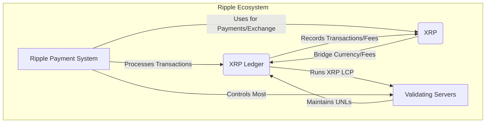
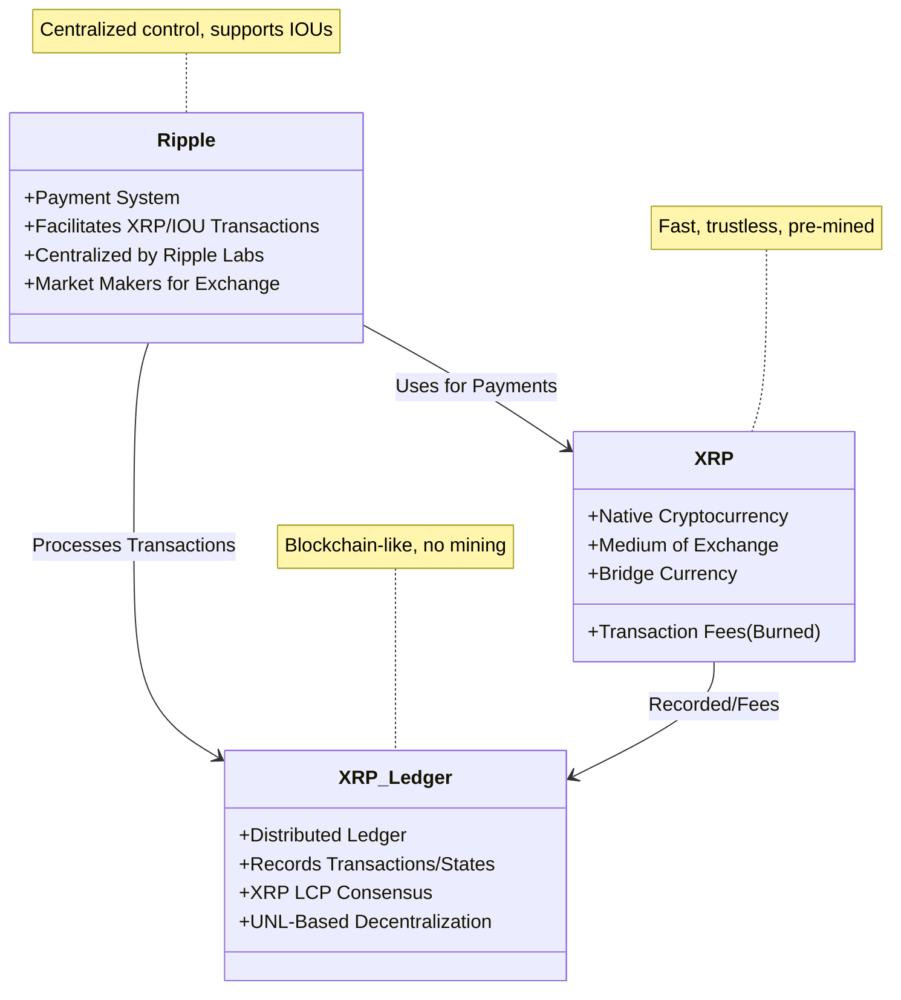

# Ripple, XRP, and XRP Ledger: Overview and Interactions

This document provides a detailed analysis of **Ripple**, **XRP**, and the **XRP Ledger**, clarifying their roles, interactions, and relationship with the XRP Ledger’s blockchain-like structure. It is based on primary sources [1, 2, 3] and referenced links [4, 5]. Mermaid diagrams illustrate the differences and similarities, while LaTeX explains the mathematical conditions for the XRP Ledger Consensus Protocol (XRP LCP).

## 1. Definitions and Roles

### 1.1 Ripple
- **Definition**: Ripple is a decentralized payment system designed for fast, low-cost cross-border transactions and currency exchanges, supporting both its native cryptocurrency (XRP) and other currencies via IOUs (credit-based transactions).
- **Role**:
  - Facilitates payments in XRP or IOUs, enabling users to transfer value globally [2, p. 2].
  - Supports roles: **users** (send/receive payments), **market makers** (enable currency trades), and **validating servers** (execute consensus) [2, p. 2].
  - Managed by Ripple Labs, which controls most validating servers and holds 25% of XRP, centralizing the current deployment [2, p. 9].
- **Key Features**:
  - Uses trust lines for IOU payments, requiring credit relationships [2, p. 3].
  - Acts as a currency exchange platform, with XRP as a bridge currency [2, p. 3].
  - Processes transactions in seconds, unlike Bitcoin’s hour-long confirmations [2, p. 8].

### 1.2 XRP
- **Definition**: XRP is the native cryptocurrency of the Ripple network and XRP Ledger, designed for efficient value transfer.
- **Role**:
  - **Medium of Exchange**: Enables direct, trustless payments on the XRP Ledger [2, p. 3].
  - **Bridge Currency**: Facilitates currency exchanges (e.g., USD → XRP → EUR) [2, p. 3].
  - **Transaction Fees**: Pays fees on the XRP Ledger, which are burned to prevent spam [1, p. 1].
  - **Distribution**: 100 billion XRP created initially; 20% held by founders, 25% by Ripple Labs, 55% distributed to promote growth [2, p. 2].
- **Key Features**:
  - Transactions settle in seconds, supporting fast payments [2, p. 8].
  - Enforceable on the ledger, unlike IOUs, which rely on trust [2, p. 3].

### 1.3 XRP Ledger
- **Definition**: The XRP Ledger is a distributed, open-source ledger (blockchain-like structure) that records all transactions, account balances, and trust relationships, serving as the Ripple network’s “ground truth” [3, p. 2].
- **Role**:
  - **Transaction Record**: Stores XRP payments, IOUs, offers, and trust settings [1, p. 3].
  - **Consensus Mechanism**: Uses the XRP LCP, a Byzantine fault-tolerant protocol, to agree on transaction sets without requiring universal node agreement [1, p. 1].
  - **Replicated State Machine**: Nodes apply agreed transactions deterministically to update the ledger [1, p. 1].
- **Key Features**:
  - **Ledger Structure**: Comprises ledgers with transactions, account data, timestamps, sequence numbers, and validation status, created every few seconds [2, p. 3].
  - **Last-Closed Ledger**: The latest validated ledger, reflecting the current state [3, p. 2].
  - **Unique Node List (UNL)**: Each node selects a UNL of trusted nodes for consensus, enabling decentralized operation [1, p. 3].

## 2. Interactions with the XRP Ledger

The XRP Ledger is the core blockchain-like structure of the Ripple ecosystem. Below, we detail how Ripple and XRP interact with it.

### 2.1 Ripple’s Interaction
- **Payment Processing**: Ripple processes XRP and IOU transactions on the XRP Ledger, ensuring validation and consistency [1, p. 1].
- **Consensus Participation**: Validating servers (mostly Ripple Labs-run) execute XRP LCP to validate transaction sets, updating the ledger [2, p. 3].
- **IOU Transactions**: Records trust lines and credit balances for IOU payments, ensuring sufficient credit exists along payment paths [2, p. 3].
- **Market Making**: Market makers create OfferCreate transactions on the ledger to enable currency exchanges [2, p. 14].
- **Centralized Control**: Ripple Labs’ control over validating servers centralizes ledger security [2, p. 9].

### 2.2 XRP’s Interaction
- **Native Asset**: XRP transactions are recorded directly on the ledger, updating account balances [1, p. 3].
- **Fees**: Small XRP fees, burned to deter spam, are logged on the ledger [1, p. 1].
- **Bridge Currency**: XRP facilitates currency exchanges via ledger transactions [2, p. 3].
- **Account Creation**: Requires a minimum 20 XRP payment to create an account, recorded as an AccountRoot node [2, p. 4].

### 2.3 Ripple and XRP Interaction
- **XRP Payments**: Ripple uses XRP for fast, trustless payments on the ledger [2, p. 3].
- **Currency Exchange**: Market makers leverage XRP to offer trades (e.g., XRP/BTC), recorded as OfferCreate transactions [2, p. 14].
- **Consensus**: Validating servers ensure both XRP and IOU transactions are validated, with XRP transactions being enforceable [1, p. 1; 2, p. 3].
- **Incentives**: Ripple Labs distributes XRP to promote network growth, with distributions recorded on the ledger [2, p. 2].

## 3. XRP Ledger as a Blockchain

The XRP Ledger resembles a blockchain but differs from Bitcoin’s:
- **Consensus**: Uses XRP LCP, not Proof-of-Work, for low-latency, high-throughput consensus [1, p. 2].
- **Structure**: A sequence of ledgers, each linked to its parent via a sequence number, similar to blocks [1, p. 3].
- **No Mining**: XRP is pre-mined, and fees are burned, not rewarded [2, p. 2].
- **Centralization**: Ripple Labs’ control over validating servers centralizes the deployment [2, p. 9].

### 3.1 Mathematical Conditions for Safety and Liveness

The XRP LCP’s safety (fork prevention) and liveness (forward progress) depend on UNL overlap and fault tolerance. Below, we formalize these using LaTeX.

#### Safety (Fork Prevention)
To prevent forks (two honest nodes validating conflicting ledgers), the UNL overlap must satisfy specific conditions. Assuming Byzantine accountability (nodes cannot send conflicting messages undetected), Proposition 1 states [1, p. 11]:

$$ \left|\mathrm{UNL}_i \cap \mathrm{UNL}_j\right| > n_i - q_i + n_j - q_j $$

Where:
- $\mathrm{UNL}_i$: Node $\mathcal{P}_i$’s Unique Node List.
- $n_i = \left|\mathrm{UNL}_i\right|$: Size of $\mathrm{UNL}_i$.
- $q_i = \lceil 0.8 n_i \rceil$: Quorum (80% of UNL).
- $n_i - q_i$: Maximum Byzantine faults in $\mathrm{UNL}_i$.

With 80% quorums, this requires >41% overlap of the average UNL size [1, p. 12]. Without Byzantine accountability, Proposition 4 requires [1, p. 14]:

$$ \left|\mathrm{UNL}_i \cap \mathrm{UNL}_j\right| > (n_i - q_i) + (n_j - q_j) + t_{i,j} $$

Where $t_{i,j} = \min(t_i, t_j, \left|\mathrm{UNL}_i \cap \mathrm{UNL}_j\right|)$, and $t_i \leq n_i - q_i$. This yields ~61% overlap [1, p. 14]. For full safety (no conflicting ledgers at any sequence number), Theorem 8 requires [1, p. 18]:

$$ \left|\mathrm{UNL}_i \cap \mathrm{UNL}_j\right| > \frac{n_j}{2} + n_i - q_i + t_{i,j} $$

This demands ~90% overlap with 80% quorums and 20% faults [1, p. 18]. The original whitepaper’s 20% overlap claim was incorrect [3, p. 5; 4].
#### Liveness (Forward Progress)
The FLP impossibility result prevents guaranteed liveness in asynchronous networks [1, p. 18]. Under weak asynchrony (bounded delays, no faults), censorship resilience is ensured [1, p. 5]. Theorem 11 states that in a network with a single UNL and leaf validators, the XRP Ledger cannot get stuck [1, p. 20]. However, Example 9 shows that with 99% UNL overlap, the network can stall if nodes validate conflicting branches [1, p. 19].

## 4. Differences and Similarities

### Mermaid Diagram: System Architecture

### Mermaid Diagram: Differences and Similarities

## 5. Usage Patterns (2013–2015)
- **Transactions**: Over 33 million transactions across 4.6 million ledgers, but >99% of accounts had few transactions [2, p. 13].
- **Types**: 60% OfferCreate, 20% OfferCancel, <15% payments (mostly XRP) [2, p. 14].
- **Ledger Closure**: 99% of ledgers closed in <20 seconds [2, p. 13].
- **Market**: XRP payments dominated; fiat trades included large, possibly test amounts [2, p. 15].

## 6. Future Directions
- **Cobalt Algorithm**: Proposes >60% UNL overlap, ensuring liveness under faults and asynchrony [1, p. 21].
- **Decentralization**: Plans to diversify node operators to reduce Ripple Labs’ control [1, p. 19; 2, p. 12].

## 7. Conclusion
Ripple is a payment system leveraging XRP and the XRP Ledger for fast, global transactions. XRP serves as a trustless currency and fee mechanism, while the XRP Ledger, a blockchain-like structure, ensures consistency via XRP LCP. High UNL overlap (>90%) is critical for safety, though centralization and liveness challenges persist.

## References
1. Chase, B., & MacBrough, E. (2018). Analysis of the XRP Ledger Consensus Protocol. arXiv:1802.07242 [1].
2. Armknecht, F., et al. (2015). Ripple: Overview and Outlook. TRUST 2015 [2].
3. Schwartz, D., Youngs, N., & Britto, A. (2014). The Ripple Protocol Consensus Algorithm [3].
4. XRPL.org. (2015). Correction to Ripple White Paper [4].
5. Buterin, V. (2013). Bitcoin Network Shaken by Blockchain Fork [5].
