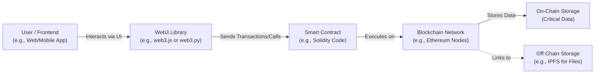

# 04 - Decentralized Applications (DApps)

## Introduction

Decentralized Applications, or DApps, are software applications that run on a decentralized network, typically a blockchain, rather than being hosted on centralized servers. Unlike traditional apps (e.g., those on app stores controlled by companies like Apple or Google), DApps leverage blockchain's distributed ledger to ensure transparency, immutability, and resistance to censorship. This section builds on the foundational concepts in earlier docs (e.g., hashing, signatures, and consensus from 01-basics.md) by introducing how these elements enable real-world applications.

**Why This Matters**:
- DApps eliminate single points of failure, making them more resilient.
- They enable trustless interactions—users don't need to trust a central authority.
- Common use cases include finance (DeFi), gaming, supply chain tracking, and more.
- Understanding DApps is key to grasping blockchain's practical value beyond cryptocurrencies.

**Prerequisites**: Basic knowledge of blockchains, smart contracts, and Ethereum-like networks. If you're new, review 01-basics.md.

**Learning Outcomes**:
- Define DApps and their key characteristics.
- Explore examples of popular DApps.
- Understand the architecture and tools for building simple DApps.

## What Are DApps?

DApps are applications where the backend logic is executed on a blockchain via smart contracts, and the frontend can be a web/mobile interface interacting with the blockchain. Key features include:
- **Decentralization**: No central control; data is stored across nodes.
- **Open Source**: Code is typically public for transparency.
- **Incentivization**: Often use tokens to reward participants (e.g., miners or validators).
- **Consensus-Driven**: Changes require network agreement.

### Types of DApps
- **Type I**: Run on their own blockchain (e.g., Bitcoin for payments).
- **Type II**: Use an existing blockchain but have their own tokens (e.g., ERC-20 tokens on Ethereum).
- **Type III**: Built on Type II protocols, adding more layers (e.g., DeFi apps on Ethereum).

### Blockchain-Based DApps Overview
Most DApps today are built on platforms like Ethereum, which supports Turing-complete smart contracts. For instance:
- **Uniswap**: A decentralized exchange (DEX) for swapping tokens without intermediaries.
- **CryptoKitties**: A game where users breed and trade digital cats as NFTs.
- **Aave**: A lending protocol where users borrow/lend crypto assets.

DApps interact with blockchains using libraries like web3.js (covered in later docs). Data is stored on-chain for critical elements (e.g., ownership) and off-chain (e.g., IPFS for files) for efficiency.

#### DApp Architecture Diagram



## Core Components of DApps

### Smart Contracts
The "brain" of a DApp. Written in languages like Solidity, they define rules and logic. (See 06-smart-contracts.md for details.)

### Frontend Integration
Users interact via web apps (e.g., React) connected to the blockchain. Wallets like MetaMask handle transactions.

### Backend Alternatives
While traditional backends are minimal, oracles (e.g., Chainlink) fetch off-chain data.

## Hands-On Examples

### Example 1: Simple DApp Overview in Python
Here's a Python script using [web3.py](https://github.com/ethereum/web3.py) to interact with an Ethereum testnet DApp (e.g., querying a smart contract). Install via `pip install web3` (assume local setup).

```python
from web3 import Web3

# Connect to a testnet (e.g., Sepolia)
w3 = Web3(Web3.HTTPProvider('https://sepolia.infura.io/v3/YOUR_INFURA_KEY'))

# Example: Check if connected
if w3.is_connected():
    print("Connected to Ethereum testnet!")
else:
    print("Connection failed.")

# Interact with a simple contract (ABI and address needed)
# contract = w3.eth.contract(address='0xContractAddress', abi=ABI)
# result = contract.functions.someFunction().call()
# print(result)
```

Full example in `/examples/04-decentralized-applications-example.py`. Replace with your Infura key.

### Example 2: Conceptual DApp Simulation
Simulate a basic voting DApp in Python without a real blockchain.

```python
class SimpleDApp:
    def __init__(self):
        self.votes = {'Option A': 0, 'Option B': 0}
    
    def vote(self, option):
        if option in self.votes:
            self.votes[option] += 1
        else:
            raise ValueError("Invalid option")
    
    def get_results(self):
        return self.votes

# Usage
dapp = SimpleDApp()
dapp.vote('Option A')
print(dapp.get_results())  # {'Option A': 1, 'Option B': 0}
```

This mimics on-chain storage; extend to use actual blockchain in advanced exercises.

## Exercises

### Beginner: Research and Summarize
1. List 3 real-world DApps and their blockchains. Explain one benefit each.

### Intermediate: Setup and Connect
2. Install [web3.py](https://github.com/ethereum/web3.py?tab=readme-ov-file#installation) and modify the example to fetch the latest block number from Ethereum mainnet. Expected output: A number > 20,000,000.

### Advanced: Build a Mini-DApp
3. Extend the simulation to include user authentication (e.g., via mock signatures from 01-basics.md). Prevent double-voting.

Solutions starters in `/exercises/04-decentralized-applications-exercises.md`.

## Advanced Topics/Extensions

### Scaling DApps
Discuss Layer 2 solutions (e.g., Optimism) for handling more transactions. Link to 08-interoperable-blockchains.md.

### Staking in DApps
Many DApps incorporate staking for governance or rewards. See 12-staking-and-interest-bearing-actions.md for details on implementing interest-bearing mechanisms.

## References and Further Reading
- Ethereum DApp Developer Guide: https://ethereum.org/en/developers/docs/dapps/
- "Mastering Ethereum" by Andreas Antonopoulos (free online chapters).
- web3.py Docs: https://web3py.readthedocs.io/
- Pull requests welcome for adding more examples!

[Previous: 03-previous-doc.md] | [Next: 05-blockchain-quorum.md] | [Back to Docs TOC](../README.md)