# 05 - Building Blockchain Using Quorum

## Introduction

Quorum is an enterprise-grade blockchain platform based on Ethereum, originally developed by JP Morgan and now maintained by ConsenSys. It extends Ethereum's capabilities for business use cases, emphasizing privacy, performance, and permissioning. This section introduces the basics of the Ethereum blockchain, highlights Quorum's unique features, and guides you through setting up a Raft-based network using Quorum along with tools like Docker and Tessera. Building on prior docs (e.g., DApps from 04-decentralized-applications.md), this shifts focus to enterprise blockchain deployment.

**Why This Matters**:
- Quorum enables private, permissioned networks ideal for industries like finance and healthcare.
- It offers faster consensus (e.g., via Raft) and privacy features not native to public Ethereum.
- Understanding Quorum helps bridge foundational crypto concepts to real-world, scalable applications.

**Prerequisites**: Knowledge of basic blockchain (from 01-basics.md), Docker basics, and command-line tools. Install Docker and Docker Compose.

**Learning Outcomes**:
- Understand Ethereum basics and Quorum's enhancements.
- Set up a multi-node Raft network.
- Use tools to initialize and interact with the network.

## Basics of Ethereum Blockchain

Ethereum is a decentralized platform for building smart contracts and DApps, using a proof-of-work (now transitioning to proof-of-stake) consensus. Key elements:
- **Blocks and Chains**: Transactions grouped into blocks, linked via hashes.
- **Smart Contracts**: Self-executing code on the blockchain.
- **Gas**: Fee mechanism for computations.
- **Nodes**: Peers maintaining the ledger.

Ethereum's public nature limits enterprise adoption due to privacy and scalability issues.

## Features of Quorum

Quorum forks Ethereum's Go-Ethereum (geth) client, adding:
- **Consensus Mechanisms**: Raft (Crash Fault Tolerant, fast block times ~50ms) and Istanbul BFT (Byzantine Fault Tolerant).
- **Privacy**: Private transactions via Tessera (successor to Constellation), using encryption for select participants.
- **Permissioning**: Restricted node joining for controlled networks.
- **No Gas Fees**: Transactions cost zero gas.
- **Performance**: 150+ TPS, hybrid public/private smart contracts.
- Compared to Ethereum: Quorum is permissioned, faster, privacy-focused, and suited for enterprises, while Ethereum is open and decentralized.

Raft Consensus: Leader-follower model for quick agreement; tolerates crashes but not malicious nodes. Blocks created on-demand, saving resources.

## Setting Up a Raft Network Using Quorum

We'll use the ConsenSys quorum-examples repo (deprecated but functional; consider quorum-dev-quickstart for newer setups). This creates a 7-node Raft network with privacy.

### Step-by-Step Guide

1. **Install Prerequisites**:
   - Docker Engine (18.02+), Docker Compose (1.21+).
   - Git.
   - Commands: `docker --version`, `docker-compose --version`, `git --version`.

2. **Clone the Repository**:
   ```
   git clone https://github.com/ConsenSys/quorum-examples.git
   cd quorum-examples
   ```

3. **Run with Docker (Raft Mode)**:
   - Start the network:
     ```
     QUORUM_CONSENSUS=raft docker-compose up -d
     ```
   - This launches nodes with Raft consensus and Tessera for privacy.
   - Verify:
     ```
     docker ps  # List running containers
     docker logs <container-name> -f  # View logs
     ```

4. **Manual Initialization (Alternative for Customization)**:
   - Navigate to 7nodes example: `cd 7nodes`
   - Initialize Raft:
     ```
     ./raft-init.sh
     ```
   - Start:
     ```
     ./raft-start.sh
     ```
   - Stop: `./stop.sh`

5. **Interact with the Network**:
   - Attach to a node: `docker exec -it <node-container> geth attach /qdata/dd1/geth.ipc` (adjust path).
   - Check peers: In console, `admin.peers`.

**Common Pitfalls**: Ensure Docker has 4GB+ memory. Generate new keys for production (use `geth account new` and Tessera keygen).

### Quorum Raft Network Diagram

```mermaid
graph TD
    subgraph RaftCluster["Quorum Raft Network"]
        Leader["Leader Node <br> (Handles requests, replicates logs)"]
        F1["Follower Node 1 <br> (Replicates from leader)"]
        F2["Follower Node 2 <br> (Replicates from leader)"]
        F3["Follower Node 3 <br> (Replicates from leader)"]
        F4["Follower Node 4 <br> (Replicates from leader)"]
    end
    Client[Client / DApp] -->|Sends Transaction| Leader
    Leader -->|Replicate Log Entries| F1
    Leader -->|Replicate Log Entries| F2
    Leader -->|Replicate Log Entries| F3
    Leader -->|Replicate Log Entries| F4
    F1 -->|"Acknowledge / Heartbeat"| Leader
    F2 -->|"Acknowledge / Heartbeat"| Leader
    F3 -->|"Acknowledge / Heartbeat"| Leader
    F4 -->|"Acknowledge / Heartbeat"| Leader
    Leader -->|Commit & Respond| Client
    style Leader fill:#006,stroke:#333,stroke-width:2px
    style F1 fill:#000,stroke:#333
    style F2 fill:#000,stroke:#333
    style F3 fill:#000,stroke:#333
    style F4 fill:#000,stroke:#333
    style Client fill:#09f,stroke:#333
    style RaftCluster fill:none,stroke:#aaa,stroke-dasharray:5
```



## Hands-On Examples

### Example 1: Connecting to Quorum Node in Python
Use `web3.py` to connect (similar to 04). Install: `pip install web3`.

```python
from web3 import Web3, IPCProvider

# Connect via IPC (assuming local Docker node)
w3 = Web3(IPCProvider('/path/to/geth.ipc'))  # Adjust to your node's IPC path, e.g., via volume mount

if w3.is_connected():
    print("Connected to Quorum node!")
    print(f"Block number: {w3.eth.block_number}")
else:
    print("Connection failed.")
```

Full script in `/examples/05-blockchain-quorum-example.py`.

### Example 2: Simple Private Transaction Simulation
In geth console: Send a private tx using `privateFor`.

## Exercises

### Beginner: Setup Verification
1. Clone and start the network; confirm 7 containers running.

### Intermediate: Node Interaction
2. Attach to a node and list peers.

### Advanced: Custom Network
3. Reduce to 4 nodes; adjust configs and restart.

Starters in `/exercises/05-blockchain-quorum-exercises.md`.

## Advanced Topics/Extensions

- Integrate with web3.js (see 07-web3js.md).
- Explore interoperability (08-interoperable-blockchains.md).
- For staking: Quorum's permissioned model can include staking-like voting; see 12-staking-and-interest-bearing-actions.md.

## References and Further Reading
- ConsenSys Quorum Docs: https://consensys.io/quorum/docs
- Quorum Examples Repo: https://github.com/ConsenSys/quorum-examples
- "Quorum Blockchain Tutorial" on 101Blockchains
- Pull requests welcome!

[Previous: 04-decentralized-applications.md] | [Next: 06-smart-contracts.md] | [Back to Docs TOC](../README.md)