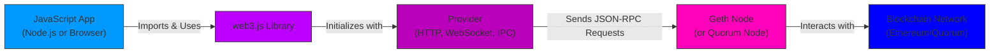

# 07 - Getting Started with web3.js

NOTE: Sunsetted, will be making documentation on ether.js or viem eventually.

## Introduction

web3.js is a comprehensive JavaScript library for interacting with Ethereum-compatible blockchains, including Quorum (from 05-blockchain-quorum.md). It allows developers to connect to nodes like Geth, query blockchain data, deploy smart contracts (as in 06-smart-contracts.md), and send transactions. This section covers importing web3.js, connecting to a Geth node, and using it in Node.js for server-side scripts or client-side JavaScript for browser-based DApps.

**Why This Matters**:
- web3.js bridges frontends to blockchains, enabling real-time interactions in DApps.
- It's essential for building user-friendly interfaces that read/write blockchain data without manual RPC calls.
- Supports both synchronous and asynchronous operations, with modern versions emphasizing Promises and async/await.

**Prerequisites**: Node.js installed (for server-side), a running Geth/Quorum node (local or testnet), and basic JavaScript knowledge. For client-side, a browser with MetaMask or similar.

**Learning Outcomes**:
- Install and import web3.js.
- Connect to a Geth node via HTTP/IPC/WebSocket.
- Use it in Node.js scripts and browser environments.

## Introducing web3.js

web3.js provides modules for Ethereum's JSON-RPC API, including `eth` for accounts/transactions, `net` for network info, and `shh` for Whisper (deprecated in newer versions). Key features:
- **Providers**: HTTP (for remote nodes), IPC (local fast access), WebSocket (subscriptions).
- **Accounts**: Create, sign transactions offline.
- **Contracts**: Deploy and interact via ABI.
- Versions: As of 2025, v4+ focuses on modularity and TypeScript support.

## Importing and Connecting to Geth

### Installation
For Node.js: `npm install web3`.
For client-side: Include via CDN `<script src="https://cdn.jsdelivr.net/npm/web3@latest/dist/web3.min.js"></script>` or bundle with webpack.

### Connecting
In Node.js:
```javascript
const Web3 = require('web3');
const web3 = new Web3('http://localhost:8545'); // Geth HTTP RPC
```

In browser (client-side):
```javascript
const web3 = new Web3(window.ethereum); // MetaMask provider
// Or: new Web3('wss://mainnet.infura.io/ws/v3/YOUR_KEY');
```

Check connection: `web3.eth.net.isListening().then(console.log);`.

For Geth/Quorum: Use IPC for local: `new Web3('/path/to/geth.ipc')`.

## Using web3.js in Node.js or Client-Side JavaScript

### Node.js Usage
Server-side for bots/scripts: Query balances, send txs.
Example: Get balance.
```javascript
async function getBalance(address) {
  const balance = await web3.eth.getBalance(address);
  console.log(web3.utils.fromWei(balance, 'ether'));
}
```

### Client-Side Usage
Browser for DApps: Connect wallet, interact with UI.
Example: Request accounts via MetaMask.
```javascript
async function connectWallet() {
  const accounts = await ethereum.request({ method: 'eth_requestAccounts' });
  console.log(accounts[0]);
}
```

Handle events: Subscribe to new blocks with WebSocket.

#### web3.js Connection Diagram



## Hands-On Examples

### Example 1: Node.js Connection and Query
```javascript
const Web3 = require('web3');
const web3 = new Web3('http://localhost:8545');

async function main() {
  const connected = await web3.eth.net.isListening();
  console.log('Connected:', connected);
  const accounts = await web3.eth.getAccounts();
  console.log('First account:', accounts[0]);
}

main();
```

Full script in `/examples/07-web3js-example.js`.

### Example 2: Client-Side Wallet Connection
In HTML/JS:
```html
<button onclick="connect()">Connect Wallet</button>
<script>
async function connect() {
  if (window.ethereum) {
    const web3 = new Web3(window.ethereum);
    await ethereum.request({ method: 'eth_requestAccounts' });
    const chainId = await web3.eth.getChainId();
    alert('Connected to chain ' + chainId);
  } else {
    alert('Install MetaMask!');
  }
}
</script>
```

## Exercises

### Beginner: Install and Connect
1. Install web3.js and connect to a local Geth node; log the chain ID.

### Intermediate: Query Balance
2. Retrieve and convert the balance of an account to Ether.

### Advanced: Send Transaction
3. Sign and send a simple ETH transfer in Node.js.

Starters in `/exercises/07-web3js-exercises.md`.

## Advanced Topics/Extensions

- Subscriptions: Real-time events with WebSocket.
- Link to interoperability (08-interoperable-blockchains.md).
- For staking: Use web3.js to interact with staking contracts (12-staking-and-interest-bearing-actions.md).

## References and Further Reading
- Official web3.js Docs: https://docs.web3js.org/
- Getting Started Guide: https://docs.web3js.org/guides/getting_started/quickstart/
- Beginner Tutorial: https://medium.com/@gupta27/getting-started-with-web3-js-a-beginners-guide-f59149f4e84d
- Pull requests welcome!

[Previous: 06-smart-contracts.md] | [Next: 08-interoperable-blockchains.md] | [Back to Docs TOC](../README.md)