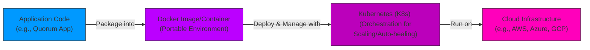

# 09 - Building Quorum as a Service Platform

## Introduction

Building Quorum as a Service (QaaS) involves deploying Quorum networks on cloud infrastructure using containerization and orchestration tools like Docker and Kubernetes. This approach enables scalable, managed blockchain services for enterprises, abstracting infrastructure complexities. This section teaches the basics of cloud computing (e.g., IaaS, PaaS, SaaS) and containerization (Docker for packaging apps), then guides you through installing Minikube (local Kubernetes), deploying containers on Kubernetes, and developing a QaaS using Quorum Node Manager (QNM) for automated node management. It extends Quorum setups from 05-blockchain-quorum.md to cloud-native environments.

**Why This Matters**:
- QaaS allows on-demand blockchain networks, reducing setup time for testing/production.
- Containerization ensures portability; Kubernetes handles scaling, resilience, and updates.
- Essential for enterprise adoption, enabling hybrid public/private chains with compliance.

**Prerequisites**: Docker installed, basic Linux/Mac commands, and Quorum knowledge. Install kubectl (Kubernetes CLI) and Helm (package manager).

**Learning Outcomes**:
- Understand cloud and container basics.
- Install and use Minikube for local Kubernetes.
- Deploy Quorum on Kubernetes using Helm charts.
- Set up QNM for managed Quorum services.

## Basics of Cloud Computing and Containerization

### Cloud Computing

Cloud models:
- **IaaS**: Virtual machines (e.g., AWS EC2).
- **PaaS**: Managed platforms (e.g., Heroku).
- **SaaS**: End-user apps (e.g., Google Workspace).
Benefits: Scalability, cost-efficiency, global access.

### Containerization

Docker packages apps with dependencies into images. Key concepts:
- **Images**: Read-only templates (e.g., `consensys/quorum:latest`).
- **Containers**: Running instances.
- Commands: `docker build`, `docker run`.

Kubernetes (K8s) orchestrates containers across clusters for auto-scaling and load balancing.

#### Cloud to K8s Flow Diagram



## Installing Minikube and Deploying Containers on Kubernetes

### Step-by-Step Guide

1. **Install Minikube**: Download from kubernetes.io; run `minikube start --driver=docker` (uses Docker VM).
2. **Verify**: `kubectl get nodes` (shows minikube-node ready).
3. **Deploy a Container**: Use kubectl or Helm.
   - Simple pod: `kubectl run nginx --image=nginx --port=80`.
   - Expose: `kubectl expose pod nginx --type=NodePort --port=80`.
   - Access: `minikube service nginx`.

For Quorum: Use Helm charts from Quorum-Kubernetes repo.

## Developing Quorum-as-a-Service Using QNM

QNM automates Quorum node lifecycle (provision, join, manage). Integrate with K8s for QaaS.

### Setup

1. Clone Quorum-Kubernetes: `git clone https://github.com/ConsenSys/quorum-kubernetes`.
2. Install Helm: `helm repo add quorum https://charts.quorum.consensys.net`.
3. Deploy: `helm install quorum quorum/quorum -f values.yaml` (customize for Raft/IBFT).
4. QNM Integration: Deploy QNM operator; configure CRDs for node pools.

Example values.yaml: Set replicas=3, consensus=raft.

```yaml
# This is a sample values.yaml file for deploying Quorum on Kubernetes using the ConsenSys Helm chart.
# Based on documentation from ConsenSys GoQuorum (as of 2025), this overrides default settings.
# Key focuses: Set replicas to 3 for scaling, consensus to 'raft' for fast enterprise consensus.
# Customize further for your environment (e.g., add persistence, monitoring).
# Usage: helm install my-quorum quorum/quorum -f values.yaml
# Reference: https://docs.goquorum.consensys.io/tutorials/kubernetes/deploy-charts
# Full examples in https://github.com/ConsenSys/quorum-kubernetes/tree/master/helm/values

# Cluster configuration
cluster:
  provider: local  # Options: local, aws, azure
  cloudNativeServices: false  # Enable for cloud secrets (e.g., AWS SSM)
  reclaimPolicy: Delete  # Volume policy: Retain or Delete

# Quorum flags
quorumFlags:
  privacy: false  # Set to true for Tessera private transactions
  removeKeysOnDelete: false
  removeGenesisOnDelete: true

# Consensus and network settings (for genesis config)
rawGenesisConfig:
  genesis:
    config:
      algorithm:
        consensus: raft  # Consensus mode: raft, ibft, qbft, clique
      blockperiodseconds: 5  # Block time in seconds (adjust for raft speed)
      epochlength: 30000
      requesttimeoutseconds: 10
    gasLimit: '0x47b760'  # Genesis gas limit
    difficulty: '0x1'  # Low difficulty for testing
    coinbase: '0x0000000000000000000000000000000000000000'
  blockchain:
    nodes:
      count: 3  # Number of initial validators (matches replicas)
      generate: true  # Auto-generate keys
    accountPassword: 'password'  # For account unlocking

# Node resources and scaling
node:
  goquorum:
    resources:
      cpuLimit: '1'  # CPU limit per pod
      cpuRequest: '0.5'
      memLimit: '2G'  # Memory limit
      memRequest: '1G'
    metrics:
      serviceMonitorEnabled: true  # Enable Prometheus monitoring

# Replicas for scaling the deployment
replicas: 3  # Number of Quorum node replicas (e.g., for high availability in raft)

# Ingress and exposure (optional)
ingress:
  enabled: false  # Enable for external access
  className: ''  # Ingress class
  hosts:
    - host: quorum.local
      paths:
        - path: /
          pathType: ImplementationSpecific

# Persistence (for data durability)
persistence:
  enabled: true
  storageClass: standard  # Use your cluster's storage class
  size: 10Gi  # Volume size per node

# Additional configs (e.g., for raft-specific)
raft:
  port: 50400  # Raft port if needed

# Notes:
# - For production, set privacy: true and integrate Tessera.
# - Customize genesis for your network ID, alloc, etc.
# - Scale replicas based on needs; raft works well with 3+ for fault tolerance.
# - Test with minikube or local K8s before cloud deployment.
```

## Hands-On Examples

### Example 1: Minikube Quorum Deployment

```bash
minikube start
helm repo add quorum https://charts.quorum.consensys.net
helm install my-quorum quorum/quorum --set consensus=raft --set replicas=1
kubectl get pods  # Verify Quorum pods
```

Full script in `/examples/09-quorum-as-a-service-platform-example.sh`.

### Example 2: QNM Node Management

YAML for QNM custom resource:

```yaml
apiVersion: qnm.consensys.io/v1
kind: QuorumNode
metadata:
  name: fedcoin-node
spec:
  quorumVersion: latest
  consensus: raft
  genesis: base64genesis
```

Apply: `kubectl apply -f node.yaml`.

## Exercises

### Beginner: Cloud/Container Quiz

1. Differentiate IaaS vs. PaaS; explain Docker's role.

### Intermediate: Minikube Setup

2. Install Minikube, deploy a sample pod, and expose it.

### Advanced: Quorum Helm Deploy

3. Customize and deploy Quorum via Helm; scale to 3 nodes.

Starters in `/exercises/09-quorum-as-a-service-platform-exercises.md`.

## Advanced Topics/Extensions

- Cloud Providers: Migrate to AWS EKS or Azure AKS.
- Monitoring: Integrate Prometheus for QaaS metrics.
- Link to medical DApps (10-dapps-for-digitizing-medical-records.md) on K8s.
- Staking: Deploy staking services on orchestrated Quorum (12-staking-and-interest-bearing-actions.md).

## References and Further Reading

- Deploy a GoQuorum private network with Kubernetes
- Create a cluster - Kubernetes - ConsenSys GoQuorum
- Hello Minikube | Kubernetes
- Pull requests welcome!

[Previous: 08-interoperable-blockchains.md] | [Next: 10-dapps-for-digitizing-medical-records.md] | [Back to Docs TOC](../README.md)