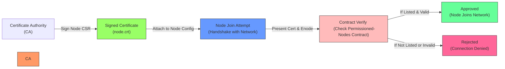

# 11 - Building a Payment Solution for Banks

## Introduction

In the banking sector, efficient, secure, and permissioned payment systems are critical for handling high-value transactions while ensuring regulatory compliance, privacy, and speed. This section explores implementing **network permissioning** in Quorum—an enterprise Ethereum fork—to create controlled access networks where only authorized participants (e.g., banks) can join and transact. We'll then build a practical payment solution that enables peer-to-peer transfers using a mobile number as the identifier, leveraging Quorum's privacy features (e.g., Tessera for private transactions) and smart contracts for logic enforcement. This builds on Quorum setups (05-blockchain-quorum.md), smart contracts (06-smart-contracts.md), and web3.js (07-web3js.md), shifting from general DApps to banking-specific use cases.

**Why This Matters**:
- Traditional banking payments (e.g., SWIFT) are slow (days) and costly; blockchain enables near-instant, low-fee transfers.
- Permissioning restricts access to vetted entities, addressing KYC/AML requirements.
- Mobile number-based transfers simplify UX (e.g., like UPI in India), reducing errors in account routing.
- As of September 13, 2025, with rising CBDC pilots (e.g., FedNow enhancements), such solutions integrate with hybrid public-private chains for global interoperability.

**Prerequisites**: Quorum with Raft/IBFT consensus running (from 05 or 09), Node.js/Python for scripting, libraries like `npm install web3 ethereumjs-tx` or `pip install web3`. Basic Solidity for contracts. A test mobile number mapping (e.g., JSON file).

**Learning Outcomes**:
- Configure Quorum for permissioned networks.
- Design smart contracts for mobile-based payments.
- Implement transfer logic with privacy and validation.
- Deploy and test the full solution.

## Network Permissioning in Quorum

Quorum's permissioning ensures only approved nodes join the network, vital for banks to prevent unauthorized access. It uses **Public Key Infrastructure (PKI)** for node authentication and **Access Control Lists (ACLs)** for transaction visibility.

### Key Concepts
- **Node Permissioning**: Nodes must present a certificate signed by a trusted CA (Certificate Authority). Unapproved nodes are rejected during handshake.
- **Transaction Permissioning**: Use `privateFor` in txs to limit visibility (e.g., only sender/receiver banks see details).
- **Benefits**: Enhances privacy (beyond public Ethereum), complies with regs like GDPR/PSD2.
- **Challenges**: Certificate management; scalability with many banks.

### Step-by-Step Implementation
1. **Set Up CA**: Use tools like OpenSSL or HashiCorp Vault to generate a root CA.
   - Command: `openssl req -new -x509 -days 365 -keyout ca.key -out ca.crt -subj "/CN=MyBankCA"`.
   - Explanation: Creates self-signed CA cert/key for signing node certs. In prod, use HSM for key security.

2. **Generate Node Certificates**: For each bank node.
   - CSR (Certificate Signing Request): `openssl req -new -key node.key -out node.csr -subj "/CN=BankNode1"`.
   - Sign: `openssl x509 -req -in node.csr -CA ca.crt -CAkey ca.key -CAcreateserial -out node.crt -days 365`.
   - Explanation: CSR proves identity; CA signs to bind public key to name. Distribute .crt to nodes.

3. **Configure Quorum Node**:
   - In `geth` flags: `--permissioned-nodes-contract-address 0x...` (deploy permissioned-nodes contract first).
   - Contract: Pre-approve node enodes (e.g., `enode://...@ip:port`).
   - Explanation: On startup, node queries contract; if not listed, it disconnects. Update contract via governance tx.

4. **Test Permissioning**:
   - Start approved node: `./geth --datadir qdata/dd1 --permissioned ...`.
   - Attempt unauthorized join: Logs rejection.
   - Explanation: Simulates bank onboarding; revoke by updating contract.

For multi-bank: Use QNM (from 09) to automate cert issuance.

#### Permissioning Flow Diagram



## Building the Payment Solution

We'll create a system where banks transfer funds via mobile numbers, resolved to on-chain addresses. Smart contract handles validation, privacy, and settlement.

### Architecture
- **Off-Chain Resolver**: Map mobile → address (e.g., database; for demo, JSON).
- **Smart Contract**: `PaymentBank` with `transfer(mobileTo, amount)`—checks permission, emits private event.
- **Privacy**: Use `privateFor` for txs visible only to involved banks.
- **UX**: Mobile app sends tx via wallet; backend resolves and broadcasts.

### Step-by-Step Development
1. **Design Smart Contract (Solidity)**:
   - Features: Owner-only mint, transfer with mobile resolution, balance query.
   - Explanation: Mobile resolution off-chain to save gas; on-chain verifies sender permission.

   ```solidity
   // SPDX-License-Identifier: MIT
   pragma solidity ^0.8.0;

   contract PaymentBank {
       mapping(address => uint256) public balances;
       mapping(string => address) public mobileToAddress;  // Off-chain sync
       address public owner;

       event Transfer(address indexed from, string mobileTo, uint256 amount);

       modifier onlyOwner() {
           require(msg.sender == owner, "Not owner");
           _;
       }

       constructor() {
           owner = msg.sender;
       }

       function registerMobile(string memory mobile, address addr) public onlyOwner {
           mobileToAddress[mobile] = addr;  // Admin syncs mappings
       }

       function transfer(string memory mobileTo, uint256 amount) public {
           address to = mobileToAddress[mobileTo];
           require(to != address(0), "Invalid mobile");
           require(balances[msg.sender] >= amount, "Insufficient balance");

           balances[msg.sender] -= amount;
           balances[to] += amount;
           emit Transfer(msg.sender, mobileTo, amount);
       }

       function mint(address to, uint256 amount) public onlyOwner {
           balances[to] += amount;
       }
   }
   ```
   - Explanation: `registerMobile` for admin (e.g., bank API syncs user mobiles). `transfer` deducts/adds balances, emits event for logs. Deploy with Remix or Truffle.

2. **Off-Chain Mobile Resolver**:
   - Simple Node.js server or script.
   - Explanation: Banks maintain a shared ledger of mobiles → addresses; use oracles for updates.

3. **Implement Transfer Logic**:
   - Resolve mobile → address.
   - Build/sign tx (off-chain for security, as in 10).
   - Broadcast with `privateFor: [toBankPubKey]` for privacy.
   - Explanation: Ensures only sender/receiver see details; auditors query public events.

4. **Deploy and Test**:
   - Deploy contract on Quorum.
   - Register mobiles: e.g., "+1234567890" → 0x...
   - Transfer: Call `transfer("+1234567890", 100)` from bank account.

## Hands-On Examples

### Example 1: Node.js Transfer Script
```javascript
const Web3 = require('web3');
const Tx = require('ethereumjs-tx').Transaction;
const util = require('ethereumjs-util');

const w3 = new Web3('http://localhost:22000');  // Quorum RPC
const abi = [/* PaymentBank ABI */];
const contract = new w3.eth.Contract(abi, '0xContractAddress');
const privateKey = Buffer.from('your-private-key-hex', 'hex');  // Secure storage

// Mobile resolver (mock)
const mobileMap = { '+1234567890': '0xToAddress' };

// Transfer function
async function bankTransfer(mobileTo, amount) {
  const accounts = await w3.eth.getAccounts();
  const from = accounts[0];
  const to = mobileMap[mobileTo];
  if (!to) throw new Error('Invalid mobile');

  const nonce = await w3.eth.getTransactionCount(from);
  const tx = contract.methods.transfer(mobileTo, amount).encodeABI();
  const txObject = {
    nonce: w3.utils.toBN(nonce),
    gasLimit: w3.utils.toBN(200000),
    gasPrice: w3.utils.toBN(0),  // Quorum: No gas
    to: '0xContractAddress',
    value: '0x00',
    data: tx
  };

  const signedTx = new Tx(txObject, { chainId: 1337 });
  signedTx.sign(privateKey);
  const serializedTx = '0x' + signedTx.serialize().toString('hex');

  const receipt = await w3.eth.sendSignedTransaction(serializedTx, { privateFor: ['0xToBankPubKey'] });
  console.log('Transfer Tx Hash:', receipt.transactionHash);
}

bankTransfer('+1234567890', 100);
```
- Explanation: Resolves mobile, encodes call, signs off-chain, broadcasts privately. Run: `node transfer.js`.

### Example 2: Python Resolver and Tx
```python
from web3 import Web3
import json

w3 = Web3(Web3.HTTPProvider('http://localhost:22000'))
with open('abi.json') as f:
    abi = json.load(f)
contract = w3.eth.contract(address='0xContractAddress', abi=abi)

mobile_map = {'+1234567890': '0xToAddress'}

def bank_transfer(mobile_to, amount):
    to = mobile_map.get(mobile_to)
    if not to:
        raise ValueError('Invalid mobile')
    txn = contract.functions.transfer(mobile_to, amount).build_transaction({
        'from': w3.eth.default_account,
        'gas': 200000,
        'gasPrice': 0,
        'nonce': w3.eth.get_transaction_count(w3.eth.default_account)
    })
    signed_txn = w3.eth.account.sign_transaction(txn, private_key='0xYourKey')
    tx_hash = w3.eth.send_raw_transaction(signed_txn.rawTransaction)
    print('Tx Hash:', tx_hash.hex())

bank_transfer('+1234567890', 100)
```
- Explanation: Similar to JS; uses web3.py for simplicity. Handles privateFor via Quorum extensions.

## Exercises

### Beginner: Permissioning Setup
1. Generate a CA and node cert; configure a Quorum node to use it.

### Intermediate: Contract Deployment
2. Deploy PaymentBank; register a mobile and mint initial balance.

### Advanced: Private Transfer
3. Implement a transfer with privateFor; verify only involved parties see it.

Starters in `/exercises/11-payment-solutions-for-banks-exercises.md`.

## Advanced Topics/Extensions

- **Interoperability**: Integrate with CBDCs (from 08) for cross-bank settlements.
- **Scalability**: Use K8s (09) for multi-region banks; add Layer-2 for speed.
- **Compliance**: Add on-chain KYC checks via oracles.
- **Other Services**: Adapt for tax payments—transfer "tax credits" via mobile to IRS; for fiduciary, escrow trusts with permissioned access.

## References and Further Reading
- Quorum Permissioning: https://docs.goquorum.consensys.io/security/permissioning
- Private Transactions: https://docs.goquorum.consensys.io/privacy/private-transactions
- Mobile Money on Blockchain: https://www.gsma.com/mobilefordevelopment/wp-content/uploads/2023/05/Blockchain-for-Mobile-Money.pdf
- Ethereum for Finance: https://ethereum.org/en/industries/finance/
- Pull requests welcome!

[Previous: 10-dapps-for-digitizing-medical-records.md] | [Next: 12-staking-and-interest-bearing-actions.md] | [Back to Docs TOC](../README.md)